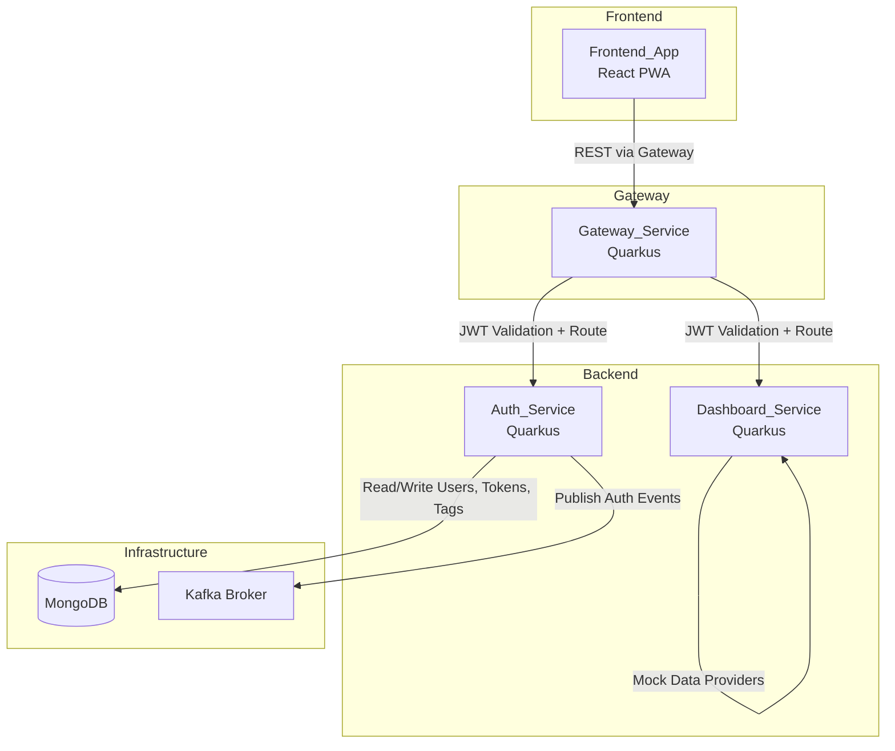
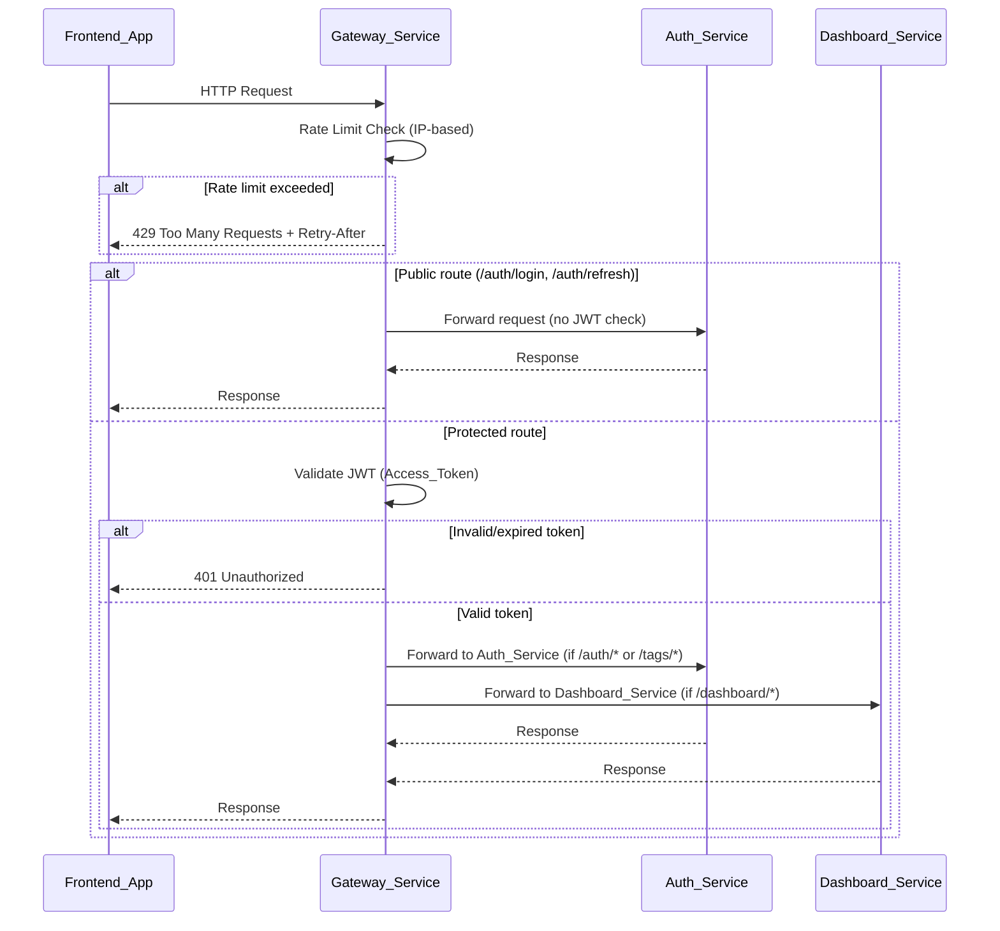
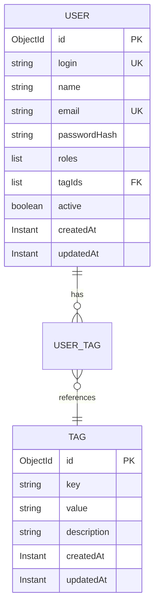

# Design Document

## Overview

This design covers the ZenAndOps 1.1.0 iteration, building on the completed MVP (1.0.0). The enhancements introduce five major capabilities:

1. **Tag-based ABAC Model** — Replace the generic `User.attributes` map with formal Tag entities (key:value pairs) for well-defined, manageable authorization policies
2. **Tag CRUD & User-Tag Assignment APIs** — Full REST API for managing tags and assigning them to users, with corresponding frontend pages
3. **Idempotent Seed Data Routine** — Startup routine that populates MongoDB with default users, roles, and tags on fresh deployments
4. **API Gateway Service** — A new `gateway-service` (Quarkus) acting as the single entry point for all client requests, handling JWT validation, request routing, and rate limiting
5. **Dynamic API Documentation** — OpenAPI/Swagger UI exposed by all services and the gateway

### Key Technical Decisions

| Decision | Choice | Rationale |
|---|---|---|
| Tag storage | Separate `tags` MongoDB collection with User holding `List<String> tagIds` | Enables Tag reuse across users, enforces uniqueness at DB level, and supports Tag CRUD independently of User lifecycle |
| Gateway implementation | Quarkus Reactive Routes + Vert.x HTTP Client | Stays within the Quarkus ecosystem; non-blocking I/O for proxying; no additional framework needed |
| Rate limiting strategy | In-memory sliding window per IP using `ConcurrentHashMap` | Simple, stateless, sufficient for single-gateway deployment; no external dependency (e.g., Redis) needed at this stage |
| Seed data trigger | Quarkus `@Observes StartupEvent` with collection-empty check | Idempotent by design; runs before HTTP listener is ready; no migration framework needed |
| OpenAPI generation | `quarkus-smallrye-openapi` extension | Auto-generates OpenAPI spec from JAX-RS annotations; includes Swagger UI out of the box |
| Frontend API routing | Single `VITE_GATEWAY_URL` env var replacing direct service URLs | Frontend communicates exclusively through the gateway; nginx proxy rules updated accordingly |

---

## Architecture

### High-Level Architecture (1.1.0)



### Gateway Request Flow



### Tag-based ABAC Model



### Service Communication (1.1.0)

- Frontend_App → Gateway_Service: All REST calls routed through the gateway (single base URL)
- Gateway_Service → Auth_Service: Proxied HTTP requests for `/api/v1/auth/*` and `/api/v1/tags/*`
- Gateway_Service → Dashboard_Service: Proxied HTTP requests for `/api/v1/dashboard/*`
- Auth_Service → MongoDB: Direct connection via Quarkus MongoDB client (users, refresh_tokens, tags collections)
- Auth_Service → Kafka: Reactive Messaging via SmallRye
- Dashboard_Service: Internal mock data providers (unchanged from MVP)

---

## Components and Interfaces

### Auth_Service — Tag Domain

#### New Domain Entities and Value Objects

| Type | Name | Description |
|---|---|---|
| Entity | `Tag` | Key-value pair entity with id, key, value, description, timestamps |
| Port | `TagRepository` | CRUD operations for Tag entities in MongoDB |
| Use Case | `CreateTagUseCase` | Creates a new Tag, enforces key:value uniqueness |
| Use Case | `ListTagsUseCase` | Retrieves paginated list of all Tags |
| Use Case | `GetTagUseCase` | Retrieves a single Tag by id |
| Use Case | `UpdateTagUseCase` | Updates the description of an existing Tag |
| Use Case | `DeleteTagUseCase` | Deletes a Tag if not assigned to any User |
| Use Case | `AssignTagsToUserUseCase` | Assigns one or more Tags to a User |
| Use Case | `RemoveTagsFromUserUseCase` | Removes one or more Tags from a User |
| Use Case | `GetUserTagsUseCase` | Retrieves all Tags assigned to a User |

#### Tag REST API (Inbound Port)

| Endpoint | Method | Description | Auth Required |
|---|---|---|---|
| `/api/v1/tags` | POST | Create a new Tag | Yes (ADMIN) |
| `/api/v1/tags` | GET | List all Tags (paginated) | Yes (ADMIN) |
| `/api/v1/tags/{id}` | GET | Get a single Tag by id | Yes (ADMIN) |
| `/api/v1/tags/{id}` | PUT | Update Tag description | Yes (ADMIN) |
| `/api/v1/tags/{id}` | DELETE | Delete a Tag | Yes (ADMIN) |

#### User-Tag Assignment REST API (Inbound Port)

| Endpoint | Method | Description | Auth Required |
|---|---|---|---|
| `/api/v1/users/{userId}/tags` | GET | List Tags assigned to a User | Yes (ADMIN) |
| `/api/v1/users/{userId}/tags` | POST | Assign Tags to a User | Yes (ADMIN) |
| `/api/v1/users/{userId}/tags` | DELETE | Remove Tags from a User | Yes (ADMIN) |

#### Updated Outbound Ports

| Port | Change |
|---|---|
| `UserRepository` | Add `findAll()` for user listing; update `save()` to handle `tagIds` field |
| `TagRepository` (new) | `save(Tag)`, `findById(String)`, `findAll(page, size)`, `findByKeyAndValue(key, value)`, `delete(String)`, `findAllByIds(List<String>)`, `existsAssignedToAnyUser(String tagId)` |
| `PolicyEngine` | `evaluateAbac()` updated to match User's resolved Tag key-value pairs against `AbacPolicy.requiredUserAttributes` |
| `TokenProvider` | `generateAccessToken()` updated to embed resolved Tag key-value pairs (instead of raw attributes map) in JWT claims |

### Auth_Service — Seed Data

| Type | Name | Description |
|---|---|---|
| Service | `SeedDataService` | Observes `StartupEvent`, checks if users collection is empty, creates default users/tags/assignments |

### Gateway_Service (New)

#### Package Structure

```
com.zenandops.gateway
├── application
│   └── port
│       ├── RouteResolver.java          // Resolves target backend URL for a given path
│       └── RateLimiter.java            // Rate limiting port
├── domain
│   └── valueobject
│       ├── RouteDefinition.java        // Path prefix → backend URL mapping
│       └── RateLimitResult.java        // Allow/deny with retry-after
└── infrastructure
    ├── adapter
    │   ├── proxy
    │   │   └── VertxHttpProxyAdapter.java  // Vert.x HTTP client for proxying
    │   ├── routing
    │   │   └── ConfigRouteResolver.java    // Config-driven route resolution
    │   └── ratelimit
    │       └── InMemoryRateLimiter.java    // Sliding window rate limiter
    └── rest
        ├── GatewayResource.java            // Catch-all route handler
        ├── HealthResource.java             // Health check endpoint
        └── GatewayExceptionMapper.java     // Error response mapper
```

#### Gateway Configuration (Environment Variables)

| Variable | Description | Default |
|---|---|---|
| `GATEWAY_AUTH_SERVICE_URL` | Auth_Service base URL | `http://auth-service:8081` |
| `GATEWAY_DASHBOARD_SERVICE_URL` | Dashboard_Service base URL | `http://dashboard-service:8082` |
| `GATEWAY_RATE_LIMIT_MAX_REQUESTS` | Max requests per window per IP | `100` |
| `GATEWAY_RATE_LIMIT_WINDOW_SECONDS` | Time window in seconds | `60` |
| `MP_JWT_VERIFY_PUBLICKEY_LOCATION` | JWT public key path | `publicKey.pem` |
| `MP_JWT_VERIFY_ISSUER` | JWT issuer | `https://zenandops.com` |

#### Gateway Route Definitions

| Path Prefix | Target Service | JWT Required |
|---|---|---|
| `/api/v1/auth/login` | Auth_Service | No |
| `/api/v1/auth/refresh` | Auth_Service | No |
| `/api/v1/auth/*` | Auth_Service | Yes |
| `/api/v1/tags/*` | Auth_Service | Yes |
| `/api/v1/users/*/tags*` | Auth_Service | Yes |
| `/api/v1/dashboard/*` | Dashboard_Service | Yes |

### Frontend_App — New Components

| Component | Description |
|---|---|
| `TagManagementPage` | Page listing all Tags in a table with create/edit/delete actions |
| `TagFormModal` | Modal form for creating or editing a Tag |
| `TagDeleteConfirmModal` | Confirmation dialog before Tag deletion |
| `UserTagsSection` | Section within user detail view showing assigned Tags with assign/remove controls |
| `useTagApi` | Custom hook encapsulating Tag CRUD API calls |
| `useUserTagApi` | Custom hook encapsulating User-Tag assignment API calls |

#### Updated Frontend Modules

| Module | Change |
|---|---|
| `ApiClient.ts` | `baseURL` set from `VITE_GATEWAY_URL` environment variable |
| `AuthContext.tsx` | `JwtClaims.attributes` replaced with `tags: Array<{key: string, value: string}>` |
| `useAuthorization.ts` | `useHasAttributes()` updated to match against Tag key-value pairs |
| `Authorize.tsx` | `attributes` prop updated to work with Tag-based claims |
| `App.tsx` | New routes: `/tags` (Tag management), updated user profile with Tag section |
| `AppSidebar.tsx` | New sidebar entry for Tag Management (ADMIN only) |
| `nginx.conf` | All `/api/*` proxied to Gateway_Service instead of individual backend services |

---

## Data Models

### Tag (Auth_Service — MongoDB `tags` Collection)

```json
{
  "_id": "ObjectId",
  "key": "string (Tag_Key)",
  "value": "string (Tag_Value)",
  "description": "string (optional)",
  "createdAt": "ISODate",
  "updatedAt": "ISODate"
}
```

MongoDB unique compound index: `{ key: 1, value: 1 }` — enforces uniqueness of key:value combinations.

### User (Auth_Service — MongoDB `users` Collection, Updated)

```json
{
  "_id": "ObjectId",
  "login": "string (unique)",
  "name": "string",
  "email": "string (unique)",
  "passwordHash": "string (bcrypt)",
  "roles": ["string"],
  "tagIds": ["ObjectId"],
  "active": "boolean",
  "createdAt": "ISODate",
  "updatedAt": "ISODate"
}
```

The `attributes` field is removed and replaced by `tagIds` — a list of references to Tag documents.

### Access_Token JWT Claims (Updated)

```json
{
  "sub": "user-login",
  "userId": "ObjectId",
  "name": "string",
  "email": "string",
  "groups": ["ADMIN", "USER"],
  "tags": [
    { "key": "department", "value": "engineering" },
    { "key": "location", "value": "HQ" }
  ],
  "iat": 1234567890,
  "exp": 1234568790
}
```

The `attributes` claim is replaced by `tags` — an array of key-value objects resolved from the User's `tagIds`.

### Tag CRUD DTOs

```java
// Request: Create Tag
public record CreateTagRequest(String key, String value, String description) {}

// Request: Update Tag
public record UpdateTagRequest(String description) {}

// Response: Tag
public record TagResponse(String id, String key, String value, String description,
                          Instant createdAt, Instant updatedAt) {}

// Response: Paginated Tags
public record PaginatedTagsResponse(List<TagResponse> items, int page, int size,
                                     long totalItems, int totalPages) {}
```

### User-Tag Assignment DTOs

```java
// Request: Assign/Remove Tags
public record UserTagsRequest(List<String> tagIds) {}

// Response: User's Tags
// Reuses List<TagResponse>
```

### Seed Data Defaults

| User Login | Password | Roles | Tags |
|---|---|---|---|
| `admin` | `admin` (bcrypt hashed) | `ADMIN`, `USER` | `department:engineering`, `location:HQ` |
| `user` | `user` (bcrypt hashed) | `USER` | `department:operations` |
| `guest` | `guest` (bcrypt hashed) | `GUEST` | (none) |

| Default Tags |
|---|
| `department:engineering` |
| `department:operations` |
| `location:HQ` |
| `location:remote` |

### Gateway Rate Limit Model

```java
public record RateLimitResult(boolean allowed, long retryAfterSeconds) {}

public record RouteDefinition(String pathPrefix, String targetBaseUrl, boolean jwtRequired) {}
```

---

## Error Handling

### Tag API Error Responses

| Scenario | HTTP Status | Error Code | Description |
|---|---|---|---|
| Duplicate key:value | 409 | `TAG_ALREADY_EXISTS` | Tag with this key:value combination already exists |
| Tag not found | 404 | `TAG_NOT_FOUND` | No Tag found with the given identifier |
| Tag in use (delete) | 409 | `TAG_IN_USE` | Tag is assigned to one or more Users and cannot be deleted |
| User not found (assignment) | 404 | `USER_NOT_FOUND` | No User found with the given identifier |
| Tag not found (assignment) | 404 | `TAG_NOT_FOUND` | One or more Tag identifiers do not exist |
| Insufficient permissions | 403 | `AUTH_FORBIDDEN` | User lacks the ADMIN role required for tag operations |
| Invalid request body | 400 | `VALIDATION_ERROR` | Request body fails validation (missing key, value, etc.) |

### Gateway Error Responses

| Scenario | HTTP Status | Error Code | Description |
|---|---|---|---|
| Rate limit exceeded | 429 | `GATEWAY_RATE_LIMITED` | Client has exceeded the request rate limit; includes `Retry-After` header |
| Invalid/expired JWT | 401 | `GATEWAY_UNAUTHORIZED` | Access_Token is missing, expired, or invalid |
| No matching route | 404 | `GATEWAY_ROUTE_NOT_FOUND` | Request path does not match any configured route |
| Backend unavailable | 503 | `GATEWAY_SERVICE_UNAVAILABLE` | Target backend service is not reachable |

### Frontend Error Handling (New)

| Scenario | Behavior |
|---|---|
| 409 on Tag create | Display "Tag already exists" message in the form |
| 409 on Tag delete | Display "Tag is in use" message in the confirmation dialog |
| 404 on Tag/User operations | Display "Not found" notification |
| 429 from Gateway | Display "Rate limit exceeded, please wait" notification |
| 503 from Gateway | Display "Service temporarily unavailable" notification |
| 403 on Tag pages | Redirect to dashboard or display "Access denied" |

### Error Response Format (All Services)

All services use the same error envelope established in the MVP:

```json
{
  "error": {
    "code": "TAG_ALREADY_EXISTS",
    "message": "A tag with key 'department' and value 'engineering' already exists",
    "timestamp": "2026-01-20T14:30:00Z"
  }
}
```

---

## Testing Strategy

Property-based testing is not applicable to this feature. The scope consists of REST API CRUD operations, infrastructure wiring (API Gateway proxying, Docker Compose), UI pages (React forms and tables), seed data routines, and configuration-driven routing. These are best validated through example-based unit tests, integration tests, and manual verification.

Per the project's established precedent from the MVP spec, no test implementation is included in this scope. Testing will be addressed in a future iteration.

### Recommended Future Testing Approach

| Layer | Strategy |
|---|---|
| Tag domain logic | Unit tests for Tag use cases (create, update, delete, uniqueness, in-use check) |
| User-Tag assignment logic | Unit tests for assign/remove/get use cases (idempotent assign, not-found handling) |
| Seed data routine | Integration test verifying idempotent behavior (run twice, assert no duplicates) |
| Policy_Engine (ABAC update) | Unit tests for Tag-based attribute matching |
| JWT claims (Tag embedding) | Unit test verifying Tag key-value pairs appear in generated tokens |
| Gateway routing | Integration tests verifying correct path-to-service mapping |
| Gateway JWT validation | Integration tests for public vs. protected route behavior |
| Gateway rate limiting | Unit tests for sliding window logic (allow, deny, retry-after calculation) |
| Tag REST endpoints | Integration tests with Quarkus test framework |
| User-Tag REST endpoints | Integration tests with Quarkus test framework |
| Frontend Tag pages | Component tests with React Testing Library |
| Frontend Gateway error handling | Component tests for 429/503 notification display |
| Docker Compose stack | Smoke tests verifying all services (including gateway) start and respond |
| OpenAPI/Swagger | Smoke tests verifying `/q/openapi` and `/q/swagger-ui` endpoints respond |
