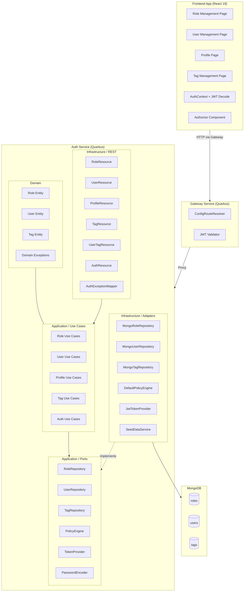

# Design Document

## Overview

This design introduces full CRUD administration for Roles and Users, a self-service profile page, and a permission-based policy system into the ZenAndOps platform. The platform's authorization module is built on a **dual RBAC + ABAC model**:

- **RBAC (Role-Based Access Control)**: Users are assigned Roles, each Role carries a set of permission strings (e.g., "users:read", "tags:write"). Endpoint access is evaluated by checking whether the user holds at least one Role with the required permission. RBAC is enforced server-side via `@RolesAllowed` annotations and the `PolicyEngine.evaluateRbac()` method, and client-side via the `useHasRole` / `useIsAuthorized` hooks.
- **ABAC (Attribute-Based Access Control)**: Users are assigned Tags (key-value pairs like `department:engineering`). Access decisions can additionally require that the user possesses specific Tag attributes, evaluated by the `PolicyEngine.evaluateAbac()` method and client-side via the `useHasAttributes` / `useIsAuthorized` hooks.

Both models coexist and are evaluated independently by the `PolicyEngine`. RBAC determines *what actions* a user can perform; ABAC determines *contextual access* based on user attributes. They can be combined for fine-grained authorization (e.g., "user must have ADMIN role AND department:engineering tag").

The current system stores roles as plain strings on the User entity with no dedicated Role entity, has no User management REST endpoints, and relies on hardcoded `@RolesAllowed("ADMIN")` annotations for access control.

The design adds:
- A **Role** domain entity stored in MongoDB with name, description, and a list of permission strings.
- **User CRUD** REST endpoints with pagination, password hashing, and self-deletion prevention.
- **Role assignment/removal** endpoints for managing user-role relationships.
- A **self-service profile** endpoint allowing users to update their own name, email, and password.
- A **permission-based policy system** where endpoint access is evaluated against permissions aggregated from the user's roles, with permissions included in the JWT access token.
- **Frontend pages** for Role Management, User Management, and Profile, following `.frontend-template` patterns.
- **Gateway route additions** for `/api/v1/roles` and `/api/v1/profile`.
- **Seed data updates** to create default Role entities and link them to seed users.

All changes maintain the existing hexagonal architecture and preserve backward compatibility with existing Tag CRUD and User-Tag assignment functionality.

## Architecture

The system follows the established hexagonal architecture pattern across three services and a frontend SPA.



### Key Architectural Decisions

1. **Role entity stores permission strings, User.roles stores role names as strings.** The User entity continues to hold `List<String> roles` containing role names (e.g., "ADMIN", "USER"). The new Role entity maps each name to a set of permissions. This avoids changing the User entity structure and maintains backward compatibility with existing `@RolesAllowed` annotations.

2. **Permissions are aggregated at token generation time.** When generating a JWT access token, the `JwtTokenProvider` resolves the user's role names into Role entities, collects all unique permissions, and includes them as a `permissions` claim in the JWT. This allows the frontend to evaluate permissions client-side without additional API calls.

3. **Existing `@RolesAllowed` annotations remain (RBAC layer).** The Quarkus SmallRye JWT extension already maps the `groups` claim to roles for `@RolesAllowed`. The new permission system is additive — endpoints can use either `@RolesAllowed` or a custom permission check. For this delivery, ADMIN-only endpoints continue using `@RolesAllowed("ADMIN")`. The ABAC layer (Tag-based evaluation via `PolicyEngine.evaluateAbac()`) remains unchanged and can be combined with RBAC for fine-grained access control.

4. **Profile endpoints use `@Authenticated` instead of `@RolesAllowed`.** Any authenticated user (ADMIN, USER, or GUEST) can access their own profile. The JWT `sub` claim identifies the current user.

5. **UserRepository is extended, not replaced.** New methods (`delete`, `findAll(page, size)`, `count`, `findByRoleContaining`, `existsByLogin`) are added to the existing `UserRepository` port.

## Components and Interfaces

### Backend — Domain Layer

#### Role Entity
```java
// domain/entity/Role.java
public class Role {
    private String id;
    private String name;           // unique, e.g. "ADMIN", "USER", "GUEST"
    private String description;
    private List<String> permissions; // e.g. ["users:read", "users:write", "roles:read"]
    private Instant createdAt;
    private Instant updatedAt;
    // getters + setters
}
```

#### New Domain Exceptions
```java
// domain/exception/RoleAlreadyExistsException.java
public class RoleAlreadyExistsException extends RuntimeException { ... }

// domain/exception/RoleNotFoundException.java
public class RoleNotFoundException extends RuntimeException { ... }

// domain/exception/RoleInUseException.java
public class RoleInUseException extends RuntimeException { ... }

// domain/exception/UserAlreadyExistsException.java
public class UserAlreadyExistsException extends RuntimeException { ... }

// domain/exception/SelfDeletionException.java
public class SelfDeletionException extends RuntimeException { ... }

// domain/exception/InvalidPasswordException.java
public class InvalidPasswordException extends RuntimeException { ... }
```

### Backend — Application Layer (Ports)

#### RoleRepository Port
```java
// application/port/RoleRepository.java
public interface RoleRepository {
    void save(Role role);
    Optional<Role> findById(String id);
    Optional<Role> findByName(String name);
    List<Role> findAllByNames(List<String> names);
    List<Role> findAll(int page, int size);
    long count();
    void delete(String id);
    boolean existsAssignedToAnyUser(String roleName);
}
```

#### UserRepository Port (Extended)
```java
// application/port/UserRepository.java — new methods added
public interface UserRepository {
    Optional<User> findByLogin(String login);
    Optional<User> findById(String id);
    List<User> findAll();                    // existing
    List<User> findAll(int page, int size);  // new: paginated
    long count();                            // new
    void save(User user);
    void delete(String id);                  // new
    boolean existsByLogin(String login);     // new
}
```

### Backend — Application Layer (Use Cases)

#### Role Use Cases
| Use Case | Input | Output | Behavior |
|---|---|---|---|
| `CreateRoleUseCase` | name, description, permissions | Role | Validates name uniqueness, creates Role |
| `ListRolesUseCase` | page, size | PaginatedResult\<Role\> | Returns paginated roles |
| `GetRoleUseCase` | id | Role | Finds by id or throws RoleNotFoundException |
| `UpdateRoleUseCase` | id, name, description, permissions | Role | Updates fields, validates name uniqueness if changed |
| `DeleteRoleUseCase` | id | void | Checks not assigned to users, deletes or throws RoleInUseException |

#### User CRUD Use Cases
| Use Case | Input | Output | Behavior |
|---|---|---|---|
| `CreateUserUseCase` | login, name, email, password, roles, tagIds | User | Validates login uniqueness, validates role names exist, hashes password, creates User |
| `ListUsersUseCase` | page, size | PaginatedResult\<User\> | Returns paginated users |
| `GetUserUseCase` | id | User | Finds by id or throws UserNotFoundException |
| `UpdateUserUseCase` | id, name, email, password?, active, roles, tagIds | User | Updates fields, hashes password if provided, validates role names exist |
| `DeleteUserUseCase` | id, currentUserId | void | Prevents self-deletion, deletes user |

#### Role Assignment Use Cases
| Use Case | Input | Output | Behavior |
|---|---|---|---|
| `AssignRolesToUserUseCase` | userId, roleNames | User | Validates role names exist as Role entities, adds to user, ignores duplicates |
| `RemoveRolesFromUserUseCase` | userId, roleNames | User | Removes specified roles from user |

#### Profile Use Cases
| Use Case | Input | Output | Behavior |
|---|---|---|---|
| `GetProfileUseCase` | currentUserLogin | User | Returns current user's data |
| `UpdateProfileUseCase` | currentUserLogin, name, email | User | Updates only name and email |
| `ChangePasswordUseCase` | currentUserLogin, currentPassword, newPassword | void | Verifies current password, hashes and stores new password |

### Backend — Infrastructure Layer (REST)

#### RoleResource — `/api/v1/roles`
| Method | Path | Auth | Description |
|---|---|---|---|
| POST | `/api/v1/roles` | @RolesAllowed("ADMIN") | Create role |
| GET | `/api/v1/roles` | @RolesAllowed("ADMIN") | List roles (paginated) |
| GET | `/api/v1/roles/{id}` | @RolesAllowed("ADMIN") | Get role by id |
| PUT | `/api/v1/roles/{id}` | @RolesAllowed("ADMIN") | Update role |
| DELETE | `/api/v1/roles/{id}` | @RolesAllowed("ADMIN") | Delete role |

#### UserResource — `/api/v1/users`
| Method | Path | Auth | Description |
|---|---|---|---|
| POST | `/api/v1/users` | @RolesAllowed("ADMIN") | Create user |
| GET | `/api/v1/users` | @RolesAllowed("ADMIN") | List users (paginated) |
| GET | `/api/v1/users/{id}` | @RolesAllowed("ADMIN") | Get user by id |
| PUT | `/api/v1/users/{id}` | @RolesAllowed("ADMIN") | Update user |
| DELETE | `/api/v1/users/{id}` | @RolesAllowed("ADMIN") | Delete user |

#### UserRoleResource — `/api/v1/users/{userId}/roles`
| Method | Path | Auth | Description |
|---|---|---|---|
| POST | `/api/v1/users/{userId}/roles` | @RolesAllowed("ADMIN") | Assign roles |
| DELETE | `/api/v1/users/{userId}/roles` | @RolesAllowed("ADMIN") | Remove roles |

#### ProfileResource — `/api/v1/profile`
| Method | Path | Auth | Description |
|---|---|---|---|
| GET | `/api/v1/profile` | @Authenticated | Get current user profile |
| PUT | `/api/v1/profile` | @Authenticated | Update name and email |
| POST | `/api/v1/profile/password` | @Authenticated | Change password |

### Backend — Infrastructure Layer (REST DTOs)

```java
// Role DTOs
record CreateRoleRequest(String name, String description, List<String> permissions) {}
record UpdateRoleRequest(String name, String description, List<String> permissions) {}
record RoleResponse(String id, String name, String description, List<String> permissions,
                    Instant createdAt, Instant updatedAt) {}
record PaginatedRolesResponse(List<RoleResponse> items, int page, int size,
                               long totalItems, int totalPages) {}

// User DTOs
record CreateUserRequest(String login, String name, String email, String password,
                         List<String> roles, List<String> tagIds) {}
record UpdateUserRequest(String name, String email, String password,
                         Boolean active, List<String> roles, List<String> tagIds) {}
record UserResponse(String id, String login, String name, String email,
                    List<String> roles, List<String> tagIds, boolean active,
                    Instant createdAt, Instant updatedAt) {}
record PaginatedUsersResponse(List<UserResponse> items, int page, int size,
                               long totalItems, int totalPages) {}

// Profile DTOs
record ProfileResponse(String login, String name, String email,
                        List<String> roles, List<TagResponse> tags) {}
record UpdateProfileRequest(String name, String email) {}
record ChangePasswordRequest(String currentPassword, String newPassword) {}

// Role Assignment DTOs
record UserRolesRequest(List<String> roleNames) {}
```

### Backend — Infrastructure Layer (Adapters)

#### MongoRoleRepository
- New Panache entity `RolePanacheEntity` with unique index on `name`.
- Implements `RoleRepository` port following the same pattern as `MongoTagRepository`.
- `existsAssignedToAnyUser(roleName)` queries `UserPanacheEntity.count("roles", roleName)`.

#### MongoUserRepository (Extended)
- Add `findAll(int page, int size)` with Panache pagination.
- Add `count()` via `UserPanacheEntity.count()`.
- Add `delete(String id)` via `UserPanacheEntity.deleteById(...)`.
- Add `existsByLogin(String login)` via `UserPanacheEntity.count("login", login) > 0`.

#### JwtTokenProvider (Modified)
- Accept a `List<String> permissions` parameter (or resolve internally via `RoleRepository`).
- Add a `permissions` claim to the JWT containing the aggregated unique permission strings.

#### SeedDataService (Modified)
- Create default Role entities: ADMIN (all permissions), USER (profile:read, profile:write), GUEST (dashboard:read).
- Assign role names to seed users as before (no change to User entity structure).

#### AuthExceptionMapper (Extended)
- Add mappings for new exceptions: `RoleAlreadyExistsException` → 409, `RoleNotFoundException` → 404, `RoleInUseException` → 409, `UserAlreadyExistsException` → 409, `SelfDeletionException` → 409, `InvalidPasswordException` → 401.

### Gateway — ConfigRouteResolver (Modified)

Add new protected route definitions:
```java
definitions.add(new RouteDefinition("/api/v1/roles", authServiceUrl, true));
definitions.add(new RouteDefinition("/api/v1/profile", authServiceUrl, true));
// /api/v1/users already exists
```

### Frontend — New Pages

#### Role Management Page (`/roles`)
- Paginated table: name, description, permission count.
- Create/Edit modal with name, description, and permission multi-select.
- Delete confirmation modal with in-use check feedback.
- ADMIN-only access via `Authorize` component.

#### User Management Page (`/users`)
- Paginated table: name, login, email, roles (badges), active status (badge), creation date.
- Create modal: login, name, email, password, role multi-select, tag multi-select.
- Edit modal: name, email, password (optional), roles, tags, active toggle.
- Delete confirmation modal with self-deletion prevention feedback.
- ADMIN-only access via `Authorize` component.

#### Profile Page (`/profile`)
- Display: login (read-only), name (editable), email (editable), roles (read-only badges), tags (read-only badges).
- Password change section: current password, new password, confirm password with client-side match validation.
- Available to all authenticated users.

### Frontend — New Hooks

```typescript
// hooks/useRoleApi.ts
useRoleApi() → { createRole, listRoles, getRole, updateRole, deleteRole }

// hooks/useUserApi.ts
useUserApi() → { createUser, listUsers, getUser, updateUser, deleteUser,
                  assignRoles, removeRoles }

// hooks/useProfileApi.ts
useProfileApi() → { getProfile, updateProfile, changePassword }
```

### Frontend — Sidebar Updates

Add new navigation items to `navItems` array in `AppSidebar.tsx`:
```typescript
{ icon: <ShieldIcon />, name: "Role Management", path: "/roles", adminOnly: true },
{ icon: <UsersIcon />, name: "User Management", path: "/users", adminOnly: true },
{ icon: <UserIcon />, name: "Profile", path: "/profile" },  // no adminOnly — all users
```

### Frontend — Route Updates

Add new routes in `App.tsx`:
```tsx
<Route path="/roles" element={<Authorize roles={["ADMIN"]} fallback={<Navigate to="/" replace />}><RoleManagement /></Authorize>} />
<Route path="/users" element={<Authorize roles={["ADMIN"]} fallback={<Navigate to="/" replace />}><UserManagement /></Authorize>} />
<Route path="/profile" element={<Profile />} />
```

### Frontend — AuthContext Updates (RBAC + ABAC)

Add `permissions` to `JwtClaims` interface for RBAC client-side evaluation. The existing `tags` field already supports ABAC client-side evaluation:
```typescript
interface JwtClaims {
  // ... existing fields
  roles: string[];                          // RBAC: role names
  tags: Array<{ key: string; value: string }>; // ABAC: tag attributes
  permissions: string[];                    // RBAC: aggregated permissions from roles (new)
}
```

The existing `useIsAuthorized` hook already supports combined RBAC + ABAC checks:
```typescript
// RBAC only
useIsAuthorized({ roles: ["ADMIN"] })
// ABAC only
useIsAuthorized({ attributes: { department: "engineering" } })
// Combined RBAC + ABAC
useIsAuthorized({ roles: ["ADMIN"], attributes: { department: "engineering" } })
```

### Permission Strings (RBAC Layer)

Standard RBAC permission set following `resource:action` pattern:

| Permission | Description |
|---|---|
| `users:read` | View user list and details |
| `users:write` | Create, update, delete users |
| `roles:read` | View role list and details |
| `roles:write` | Create, update, delete roles |
| `tags:read` | View tag list and details |
| `tags:write` | Create, update, delete tags |
| `profile:read` | View own profile |
| `profile:write` | Update own profile and password |
| `dashboard:read` | View dashboard |

Default Role → Permission mapping:
| Role | Permissions |
|---|---|
| ADMIN | All permissions |
| USER | `profile:read`, `profile:write`, `dashboard:read` |
| GUEST | `dashboard:read` |

## Data Models

### Role Collection (MongoDB)

```json
{
  "_id": ObjectId,
  "name": "ADMIN",                    // unique index
  "description": "Full system access",
  "permissions": ["users:read", "users:write", "roles:read", "roles:write",
                   "tags:read", "tags:write", "profile:read", "profile:write",
                   "dashboard:read"],
  "createdAt": ISODate,
  "updatedAt": ISODate
}
```

Indexes:
- `{ name: 1 }` — unique

### User Collection (MongoDB) — Existing, No Schema Change

```json
{
  "_id": ObjectId,
  "login": "admin",
  "name": "Administrator",
  "email": "admin@zenandops.com",
  "passwordHash": "...",
  "roles": ["ADMIN", "USER"],         // role names (strings)
  "tagIds": ["<tag-object-id>"],
  "active": true,
  "createdAt": ISODate,
  "updatedAt": ISODate
}
```

The `roles` field continues to store role name strings. The relationship to Role entities is resolved at runtime (e.g., during JWT generation or role assignment validation).

### JWT Access Token Claims — Updated (RBAC + ABAC)

The JWT carries both RBAC and ABAC data for client-side evaluation:
- `groups` — Role names for `@RolesAllowed` enforcement (RBAC)
- `permissions` — Aggregated permission strings from all Roles (RBAC)
- `tags` — Tag key-value pairs for attribute-based checks (ABAC)

```json
{
  "sub": "admin",
  "userId": "...",
  "name": "Administrator",
  "email": "admin@zenandops.com",
  "groups": ["ADMIN", "USER"],
  "tags": [{"key": "department", "value": "engineering"}],
  "permissions": ["users:read", "users:write", "roles:read", "roles:write",
                   "tags:read", "tags:write", "profile:read", "profile:write",
                   "dashboard:read"],
  "iss": "https://zenandops.com",
  "iat": 1234567890,
  "exp": 1234568790
}
```


## Correctness Properties

*A property is a characteristic or behavior that should hold true across all valid executions of a system — essentially, a formal statement about what the system should do. Properties serve as the bridge between human-readable specifications and machine-verifiable correctness guarantees.*

### Property 1: Role CRUD Round-Trip

*For any* valid role data (name, description, permissions), creating a Role and then retrieving it by id should return an entity with matching name, description, and permissions. Furthermore, updating any field and then retrieving should reflect the update, and deleting an unassigned role then retrieving should yield a 404.

**Validates: Requirements 1.2, 1.5, 1.7, 1.8**

### Property 2: Role Name Uniqueness

*For any* valid role name, creating a Role with that name and then attempting to create another Role with the same name should result in a 409 conflict rejection on the second attempt.

**Validates: Requirements 1.3**

### Property 3: Role Deletion Prevented When Assigned

*For any* Role that is assigned to at least one User, attempting to delete that Role should result in a 409 conflict rejection, and the Role should remain in the system.

**Validates: Requirements 1.9**

### Property 4: User CRUD Round-Trip

*For any* valid user data (login, name, email, password, roles, tagIds), creating a User and then retrieving it by id should return an entity with matching login, name, email, roles, tagIds, and active status. Furthermore, updating fields and then retrieving should reflect the update, and deleting a user (not self) then retrieving should yield a 404.

**Validates: Requirements 2.1, 2.4, 2.6, 2.8**

### Property 5: User Login Uniqueness

*For any* valid login string, creating a User with that login and then attempting to create another User with the same login should result in a 409 conflict rejection on the second attempt.

**Validates: Requirements 2.2**

### Property 6: Password Hash Never Exposed

*For any* User-returning endpoint (create, get, list, update, profile), the response body should never contain a `passwordHash` field.

**Validates: Requirements 2.1, 2.3, 2.4, 2.6, 4.1**

### Property 7: Non-ADMIN Access Denied

*For any* non-ADMIN authenticated user and *for any* admin-only endpoint (Role CRUD, User CRUD, Role assignment), the request should be rejected with HTTP status 403.

**Validates: Requirements 1.10, 2.10, 3.5**

### Property 8: Role Assignment Idempotence

*For any* User and *for any* valid Role name, assigning that role to the user twice should result in the role appearing exactly once in the user's roles list.

**Validates: Requirements 3.4**

### Property 9: Role Assignment Adds and Removal Removes

*For any* User and *for any* set of valid Role names, assigning those roles should result in the user's roles list containing all of them. Subsequently removing a subset should result in those roles being absent from the user's roles list while the remaining roles are preserved.

**Validates: Requirements 3.1, 3.2**

### Property 10: Non-Existent Role Assignment Rejected

*For any* role name that does not correspond to an existing Role entity, attempting to assign it to any User should result in a 404 rejection.

**Validates: Requirements 3.3**

### Property 11: Profile Update Field Restriction

*For any* authenticated user and *for any* profile update request containing arbitrary values for roles, tagIds, login, or active, those fields should remain unchanged after the update. Only name and email should be modifiable.

**Validates: Requirements 4.2, 4.3**

### Property 12: Password Change Round-Trip

*For any* user and *for any* valid new password, changing the password (via profile or admin update) should allow authentication with the new password and prevent authentication with the old password.

**Validates: Requirements 2.7, 4.4**

### Property 13: Incorrect Password Rejected

*For any* authenticated user and *for any* string that does not match the user's current password, attempting to change the password with that incorrect current password should result in a 401 rejection.

**Validates: Requirements 4.5**

### Property 14: RBAC Permission Evaluation

*For any* User with a set of Roles and *for any* required permission string, RBAC access should be granted if and only if at least one of the user's Roles contains that permission.

**Validates: Requirements 5.2, 5.3, 5.4**

### Property 15: JWT RBAC + ABAC Claim Aggregation

*For any* User with a set of Roles and Tags, the JWT access token should contain: (a) a `permissions` claim equal to the union of all permission strings from all of the user's Roles (RBAC, no duplicates, no omissions), and (b) a `tags` claim containing all resolved Tag key-value pairs (ABAC).

**Validates: Requirements 5.5**

### Property 16: ABAC Tag Attribute Evaluation

*For any* User with a set of Tags and *for any* AbacPolicy requiring specific user attributes, ABAC access should be granted if and only if the user's resolved Tags contain all required key-value pairs specified in the policy.

**Validates: Requirements 5.7**

### Property 17: Paginated Listing Consistency

*For any* collection of N items (Roles or Users) and *for any* valid page/size parameters, the paginated response should report `totalItems = N`, `totalPages = ceil(N / size)`, and the items on each page should be a correct slice of the full collection.

**Validates: Requirements 1.4, 2.3**

### Property 18: Combined RBAC + ABAC Evaluation

*For any* User and *for any* authorization check that specifies both required Roles and required Tag attributes, access should be granted if and only if the user satisfies both the RBAC condition (holds a Role with the required permission) AND the ABAC condition (possesses all required Tag key-value pairs).

**Validates: Requirements 5.7, 5.8**

## Error Handling

### Backend Error Strategy

All domain exceptions are caught by the existing `AuthExceptionMapper` and converted to structured JSON error responses. The mapper is extended with new exception types:

| Exception | HTTP Status | Error Code | Trigger |
|---|---|---|---|
| `RoleAlreadyExistsException` | 409 Conflict | `ROLE_ALREADY_EXISTS` | Duplicate role name on create |
| `RoleNotFoundException` | 404 Not Found | `ROLE_NOT_FOUND` | Role id not found |
| `RoleInUseException` | 409 Conflict | `ROLE_IN_USE` | Delete role assigned to users |
| `UserAlreadyExistsException` | 409 Conflict | `USER_ALREADY_EXISTS` | Duplicate login on create |
| `SelfDeletionException` | 409 Conflict | `USER_SELF_DELETION` | Admin attempts to delete self |
| `InvalidPasswordException` | 401 Unauthorized | `AUTH_INVALID_PASSWORD` | Wrong current password on change |
| `UserNotFoundException` | 404 Not Found | `USER_NOT_FOUND` | Already exists |
| `TagNotFoundException` | 404 Not Found | `TAG_NOT_FOUND` | Already exists |
| `AccessDeniedException` | 403 Forbidden | `AUTH_FORBIDDEN` | Already exists |

Error response format (unchanged):
```json
{
  "error": {
    "code": "ROLE_ALREADY_EXISTS",
    "message": "A role with name 'ADMIN' already exists",
    "timestamp": "2026-01-15T10:30:00Z"
  }
}
```

### Frontend Error Strategy

- API errors are caught in hook callbacks and displayed as inline error messages in modals/forms.
- 401 errors trigger the existing token refresh flow in `ApiClient.ts`.
- 403 errors on navigation are handled by the `Authorize` component redirecting to home.
- 409 conflict errors display the server-provided error message to the user.
- Network errors display a generic "An error occurred" message.

### Validation

- Backend: Use case classes validate required fields before persistence. No Jakarta Bean Validation annotations — validation is explicit in use case logic (consistent with existing pattern).
- Frontend: Client-side validation for required fields, password confirmation match, and non-empty inputs before API calls.

## Testing Strategy

### Testing Approach

This feature uses a **dual testing approach**:

- **Property-based tests** verify universal correctness properties across many generated inputs (minimum 100 iterations per property).
- **Example-based unit tests** verify specific scenarios, edge cases, and UI behavior.
- **Integration/smoke tests** verify routing, seed data, and end-to-end flows.

### Property-Based Testing

**Library:** [jqwik](https://jqwik.net/) for Java (integrates with JUnit 5 and Quarkus).

Each property test:
- Runs a minimum of 100 iterations with randomly generated inputs.
- References its design document property via a tag comment.
- Tag format: `Feature: admin-tags-roles-users, Property {number}: {property_text}`

Properties 1–16 from the Correctness Properties section are implemented as property-based tests targeting the use case and domain layers (mocking repository ports for pure logic tests, or using in-memory implementations for round-trip tests).

### Unit Tests (Example-Based)

| Area | Tests |
|---|---|
| Role CRUD | Non-existent id → 404, seed data creates expected roles |
| User CRUD | Non-existent id → 404, self-deletion → 409 |
| Profile | Unauthenticated → 401 |
| Frontend Role Page | Route renders, table columns present, create/edit/delete modals |
| Frontend User Page | Route renders, table columns present, create/edit/delete modals |
| Frontend Profile Page | Route renders, fields displayed, password mismatch validation |
| Frontend Sidebar | ADMIN sees Tags/Roles/Users, GUEST sees only Dashboard/Profile |
| Frontend Authorization | Non-ADMIN redirect on /roles, /users |

### Smoke Tests

| Area | Tests |
|---|---|
| Gateway Routing | /api/v1/roles, /api/v1/profile routes exist with jwtRequired=true |
| Seed Data | Default Role entities created with correct permissions |
| Permission Constants | All permission strings follow resource:action pattern |

### No Tests Required

Per project constraints, no tests are required for this delivery. The testing strategy above documents what should be tested in a future iteration.
