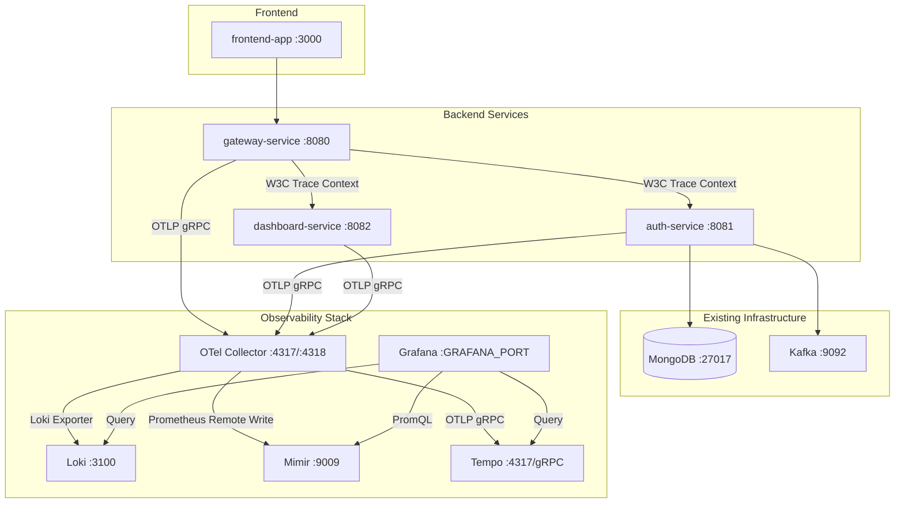

# Design Document

## Overview

This design introduces a full-stack observability layer to the ZenAndOps ITSM platform using the Grafana LGTM stack (Loki, Grafana, Tempo, Mimir) with OpenTelemetry as the vendor-neutral telemetry pipeline. The architecture follows a centralized collector pattern where all three backend microservices (auth-service, dashboard-service, gateway-service) emit traces, metrics, and logs via the OpenTelemetry SDK to a single OTel Collector instance, which then fans out telemetry data to the appropriate Grafana backend.

The Quarkus `quarkus-opentelemetry` extension provides automatic instrumentation for HTTP server/client spans, MongoDB operations, and Kafka messaging. The `quarkus-micrometer-opentelemetry` extension bridges Micrometer metrics (including JVM and HTTP server metrics) into the OpenTelemetry pipeline. Structured JSON logging with trace correlation is achieved via the Quarkus OpenTelemetry logging integration, which automatically injects `traceId` and `spanId` into log records.

All observability infrastructure (OTel Collector, Loki, Mimir, Tempo, Grafana) runs as Docker Compose services on the existing `zenandops-net` network, with health checks, persistent volumes, and environment-variable-driven configuration.

## Architecture



### Data Flow

1. Each backend service uses the Quarkus OpenTelemetry SDK to automatically instrument HTTP requests, MongoDB queries, and Kafka operations
2. Telemetry data (traces, metrics, logs) is exported via OTLP gRPC to the centralized OTel Collector on port 4317
3. The OTel Collector applies batch processing and routes data to the appropriate backend:
   - Traces → Tempo (OTLP gRPC exporter)
   - Metrics → Mimir (Prometheus remote-write exporter)
   - Logs → Loki (Loki exporter)
4. Grafana queries all three backends and provides unified dashboards with trace-to-logs and trace-to-metrics correlation

### Design Decisions

| Decision | Rationale |
|---|---|
| `quarkus-opentelemetry` over Java agent | Quarkus provides native OTel integration with build-time optimization; the Java agent approach is unnecessary and adds startup overhead |
| `quarkus-micrometer-opentelemetry` for metrics | Bridges Micrometer's mature JVM/HTTP metrics into the OTel pipeline without running a separate Prometheus scrape endpoint; single OTLP export path |
| Centralized OTel Collector | Decouples services from backend specifics; enables batch processing, retry, and future backend swaps without service changes |
| Mimir over Prometheus | Mimir provides long-term metrics storage with Prometheus compatibility; better suited for production-grade observability |
| `otel/opentelemetry-collector-contrib` image | Required for the Loki exporter and Prometheus remote-write exporter, which are not in the core distribution |
| Grafana provisioning via YAML files | Enables reproducible, version-controlled data source and dashboard configuration without manual UI setup |


## Components and Interfaces

### 1. Quarkus OpenTelemetry SDK Integration (per service)

Each backend service adds two Quarkus extensions:

- `quarkus-opentelemetry` — provides automatic tracing instrumentation for REST endpoints, REST clients, MongoDB, Kafka, and structured log export via OTLP
- `quarkus-micrometer-opentelemetry` — bridges Micrometer metrics (JVM heap, GC, threads, HTTP server metrics) into the OpenTelemetry pipeline

#### Maven Dependencies (added to each service's `pom.xml`)

```xml
<dependency>
    <groupId>io.quarkus</groupId>
    <artifactId>quarkus-opentelemetry</artifactId>
</dependency>
<dependency>
    <groupId>io.quarkus</groupId>
    <artifactId>quarkus-micrometer-opentelemetry</artifactId>
</dependency>
```

#### Application Properties (per service)

```properties
# OpenTelemetry core
quarkus.otel.exporter.otlp.endpoint=${OTEL_EXPORTER_OTLP_ENDPOINT:http://localhost:4317}
quarkus.application.name=zenandops-{service-name}

# Tracing
quarkus.otel.traces.enabled=true
quarkus.otel.traces.sampler=parentbased_traceidratio
quarkus.otel.traces.sampler.arg=${OTEL_TRACES_SAMPLER_ARG:1.0}

# Logging via OTel
quarkus.otel.logs.enabled=true

# Metrics via Micrometer bridge
quarkus.otel.metrics.enabled=true
quarkus.micrometer.binder.jvm=true
quarkus.micrometer.binder.http-server.enabled=true

# Structured JSON logging
quarkus.log.console.json=true
```

#### Automatic Instrumentation Coverage

| Instrumentation | Extension | Spans Created |
|---|---|---|
| HTTP server requests | `quarkus-opentelemetry` | Root/child spans with method, path, status |
| HTTP client (Vert.x WebClient) | `quarkus-opentelemetry` | Child spans with W3C Trace Context propagation |
| MongoDB operations | `quarkus-opentelemetry` | Child spans with operation name, collection |
| Kafka producer/consumer | `quarkus-opentelemetry` | Child spans with topic, Trace Context in headers |
| JVM metrics (heap, GC, threads) | `quarkus-micrometer-opentelemetry` | N/A (metrics only) |
| HTTP server metrics (count, duration) | `quarkus-micrometer-opentelemetry` | N/A (metrics only) |

### 2. Custom Application Metrics

Beyond automatic instrumentation, two services require custom metrics:

#### Gateway Service — Rate-Limit Gauge

```java
@ApplicationScoped
public class RateLimitMetrics {
    private final Meter meter;

    @Inject
    public RateLimitMetrics(Meter meter) {
        this.meter = meter;
    }

    public void registerBucketGauge(Supplier<Map<String, Long>> bucketSupplier) {
        meter.gaugeBuilder("zenandops.gateway.ratelimit.bucket_count")
            .setDescription("Current rate-limit bucket count per client IP")
            .setUnit("{requests}")
            .ofLongs()
            .buildWithCallback(measurement -> {
                bucketSupplier.get().forEach((ip, count) ->
                    measurement.record(count, Attributes.of(
                        AttributeKey.stringKey("client.ip"), ip)));
            });
    }
}
```

#### Auth Service — Authentication Attempt Counter

```java
@ApplicationScoped
public class AuthMetrics {
    private final LongCounter authAttempts;

    @Inject
    public AuthMetrics(Meter meter) {
        this.authAttempts = meter.counterBuilder("zenandops.auth.login.attempts")
            .setDescription("Number of authentication attempts")
            .setUnit("{attempts}")
            .build();
    }

    public void recordAttempt(boolean success) {
        authAttempts.add(1, Attributes.of(
            AttributeKey.stringKey("outcome"), success ? "success" : "failure"));
    }
}
```

### 3. OpenTelemetry Collector

The OTel Collector runs as a Docker Compose service using the `otel/opentelemetry-collector-contrib` image. It is configured via a YAML file mounted into the container.

#### Collector Configuration (`observability/otel-collector-config.yaml`)

```yaml
receivers:
  otlp:
    protocols:
      grpc:
        endpoint: 0.0.0.0:4317
      http:
        endpoint: 0.0.0.0:4318

processors:
  batch:
    timeout: 5s
    send_batch_size: 1024

exporters:
  otlp/tempo:
    endpoint: tempo:4317
    tls:
      insecure: true

  prometheusremotewrite/mimir:
    endpoint: http://mimir:9009/api/v1/push
    tls:
      insecure: true

  loki:
    endpoint: http://loki:3100/loki/api/v1/push

extensions:
  health_check:
    endpoint: 0.0.0.0:13133

service:
  extensions: [health_check]
  pipelines:
    traces:
      receivers: [otlp]
      processors: [batch]
      exporters: [otlp/tempo]
    metrics:
      receivers: [otlp]
      processors: [batch]
      exporters: [prometheusremotewrite/mimir]
    logs:
      receivers: [otlp]
      processors: [batch]
      exporters: [loki]
```

### 4. Grafana Stack Services

#### Loki (`observability/loki-config.yaml`)

Loki runs in single-binary mode with local filesystem storage. It accepts log data pushed by the OTel Collector via the Loki push API.

#### Mimir (`observability/mimir-config.yaml`)

Mimir runs in single-binary mode with local filesystem storage. It accepts metrics via the Prometheus remote-write endpoint at `/api/v1/push`.

#### Tempo (`observability/tempo-config.yaml`)

Tempo runs in single-binary mode with local filesystem storage. It accepts traces via OTLP gRPC on port 4317.

#### Grafana

Grafana is provisioned with:
- Data sources via `observability/grafana/provisioning/datasources/datasources.yaml`
- Dashboards via `observability/grafana/provisioning/dashboards/` directory
- Pre-built dashboard JSON files in `observability/grafana/dashboards/`

### 5. Grafana Data Source Provisioning

```yaml
apiVersion: 1
datasources:
  - name: Tempo
    type: tempo
    access: proxy
    url: http://tempo:3200
    jsonData:
      tracesToLogsV2:
        datasourceUid: loki
        filterByTraceID: true
        filterBySpanID: false
        customQuery: false
        tags:
          - key: service.name
            value: service_name
      tracesToMetrics:
        datasourceUid: mimir
        tags:
          - key: service.name
            value: service_name

  - name: Loki
    type: loki
    access: proxy
    uid: loki
    url: http://loki:3100
    jsonData:
      derivedFields:
        - datasourceUid: tempo
          matcherRegex: '"traceId":"(\w+)"'
          name: TraceID
          url: "$${__value.raw}"

  - name: Mimir
    type: prometheus
    access: proxy
    uid: mimir
    url: http://mimir:9009/prometheus
```


### 6. Pre-Built Grafana Dashboards

| Dashboard | Key Panels | Data Source |
|---|---|---|
| Service Overview | Request rate, error rate, p50/p95/p99 latency per service | Mimir |
| JVM Metrics | Heap memory (used/committed/max), GC count/duration, thread count per service | Mimir |
| Logs Explorer | Filterable log stream with service name, log level, traceId filters; traceId click-through to Tempo | Loki |
| Gateway Performance | Rate-limit bucket counts, upstream response times, error breakdown by downstream service | Mimir |
| Authentication Metrics | Login success/failure rate, token generation latency | Mimir |

### 7. Docker Compose Integration

New services added to `docker-compose.yml`:

| Service | Image | Ports | Depends On |
|---|---|---|---|
| `otel-collector` | `otel/opentelemetry-collector-contrib` | 4317, 4318, 13133 | loki, mimir, tempo |
| `loki` | `grafana/loki` | 3100 | — |
| `mimir` | `grafana/mimir` | 9009 | — |
| `tempo` | `grafana/tempo` | 3200, 4317 | — |
| `grafana` | `grafana/grafana` | `${GRAFANA_PORT}` | loki, mimir, tempo |

Existing services (auth-service, dashboard-service, gateway-service) receive the `OTEL_EXPORTER_OTLP_ENDPOINT` environment variable pointing to `http://otel-collector:4317`.

### 8. Configuration File Layout

```
observability/
├── otel-collector-config.yaml
├── loki-config.yaml
├── mimir-config.yaml
├── tempo-config.yaml
└── grafana/
    ├── provisioning/
    │   ├── datasources/
    │   │   └── datasources.yaml
    │   └── dashboards/
    │       └── dashboards.yaml
    └── dashboards/
        ├── service-overview.json
        ├── jvm-metrics.json
        ├── logs-explorer.json
        ├── gateway-performance.json
        └── auth-metrics.json
```

## Data Models

### Structured Log Format (JSON)

All backend services emit logs in the following JSON structure via the Quarkus JSON logging formatter with OpenTelemetry trace correlation:

```json
{
  "timestamp": "2026-01-15T10:30:00.123Z",
  "level": "INFO",
  "message": "User login successful",
  "service.name": "zenandops-auth",
  "traceId": "abc123def456...",
  "spanId": "789ghi012...",
  "logger.name": "com.zenandops.auth.application.usecase.LoginUseCase"
}
```

When no active trace context exists, `traceId` and `spanId` are empty strings.

### Trace Span Attributes

| Attribute | Type | Description |
|---|---|---|
| `http.method` | string | HTTP method (GET, POST, etc.) |
| `http.url` | string | Full request URL path |
| `http.status_code` | int | HTTP response status code |
| `http.route` | string | Matched route pattern |
| `db.system` | string | Database system (mongodb) |
| `db.operation` | string | Database operation (find, insert, etc.) |
| `db.mongodb.collection` | string | MongoDB collection name |
| `messaging.system` | string | Messaging system (kafka) |
| `messaging.destination.name` | string | Kafka topic name |
| `service.name` | string | Service resource attribute |

### Metrics Inventory

#### Automatic Metrics (via Micrometer bridge)

| Metric Name | Type | Labels | Source |
|---|---|---|---|
| `http.server.requests` | Histogram | method, uri, status, outcome | All services |
| `jvm.memory.used` | Gauge | area, id | All services |
| `jvm.memory.committed` | Gauge | area, id | All services |
| `jvm.memory.max` | Gauge | area, id | All services |
| `jvm.gc.pause` | Timer | action, cause | All services |
| `jvm.threads.live` | Gauge | — | All services |
| `jvm.threads.daemon` | Gauge | — | All services |
| `jvm.threads.peak` | Gauge | — | All services |

#### Custom Metrics

| Metric Name | Type | Labels | Source |
|---|---|---|---|
| `zenandops.gateway.ratelimit.bucket_count` | Gauge | client.ip | Gateway Service |
| `zenandops.auth.login.attempts` | Counter | outcome (success/failure) | Auth Service |

### Environment Variables (New)

| Variable | Default | Description |
|---|---|---|
| `OTEL_EXPORTER_OTLP_ENDPOINT` | `http://otel-collector:4317` | OTel Collector gRPC endpoint |
| `OTEL_TRACES_SAMPLER_ARG` | `1.0` | Trace sampling ratio (0.0–1.0) |
| `GRAFANA_PORT` | `3000` | Grafana exposed host port |
| `OTEL_COLLECTOR_PORT_GRPC` | `4317` | OTel Collector gRPC port |
| `OTEL_COLLECTOR_PORT_HTTP` | `4318` | OTel Collector HTTP port |
| `LOKI_PORT` | `3100` | Loki HTTP port |
| `MIMIR_PORT` | `9009` | Mimir HTTP port |
| `TEMPO_PORT` | `3200` | Tempo HTTP query port |


## Correctness Properties

*A property is a characteristic or behavior that should hold true across all valid executions of a system — essentially, a formal statement about what the system should do. Properties serve as the bridge between human-readable specifications and machine-verifiable correctness guarantees.*

This feature is predominantly infrastructure configuration (Docker Compose, YAML configs, Grafana provisioning) and framework integration (Quarkus OpenTelemetry extensions). The vast majority of acceptance criteria are SMOKE or INTEGRATION tests that verify configuration correctness or external service behavior.

Only two acceptance criteria involve custom application code with meaningful input variation: the rate-limit gauge metric (4.7) and the authentication attempt counter (4.8). These are the only candidates for property-based testing.

### Property 1: Rate-limit gauge reports correct bucket counts

*For any* map of client IP addresses to request counts, when the rate-limit gauge callback is invoked, it SHALL report the exact count value for each IP address present in the map.

**Validates: Requirements 4.7**

### Property 2: Authentication attempt counter tracks outcomes correctly

*For any* sequence of authentication attempts (each being either success or failure), after recording all attempts, the counter SHALL report a total equal to the number of successes for the "success" outcome and a total equal to the number of failures for the "failure" outcome.

**Validates: Requirements 4.8**

## Error Handling

### Service-Level Error Handling

| Scenario | Behavior |
|---|---|
| OTel Collector unreachable at startup | Backend services continue operating normally; Quarkus OTel SDK retries connection with exponential backoff (built-in behavior) |
| OTel Collector goes down during operation | Telemetry data is dropped silently; service functionality is unaffected; SDK reconnects when collector returns |
| Invalid `OTEL_TRACES_SAMPLER_ARG` value | Quarkus falls back to default sampler (`parentbased_always_on`) and logs a warning |
| Loki/Mimir/Tempo backend unreachable from Collector | OTel Collector buffers data in memory via retry/queue configuration and retries with exponential backoff |
| Grafana cannot reach a data source | Grafana displays "Data source is not reachable" in the dashboard panel; other panels continue working |

### Logging Error Handling

| Scenario | Behavior |
|---|---|
| Log emitted outside trace context | `traceId` and `spanId` fields are set to empty strings in the JSON output |
| Exception during request handling | Service logs at ERROR level with exception type, message, and stack trace; span status is set to ERROR |
| JSON logging formatter failure | Falls back to plain-text logging (Quarkus built-in fallback) |

### Infrastructure Error Handling

| Scenario | Behavior |
|---|---|
| Observability service fails health check | Docker Compose reports unhealthy status; dependent services wait or proceed based on `depends_on` condition |
| Volume mount failure | Container fails to start; Docker Compose reports error |
| Port conflict | Container fails to bind; Docker Compose reports error with port details |

## Testing Strategy

### Testing Approach

This feature is primarily infrastructure and configuration, so the testing strategy emphasizes integration tests and smoke tests over unit tests. Property-based testing is limited to the two custom metrics classes.

### Unit Tests

- **AuthMetrics**: Verify counter increments correctly for success and failure outcomes using a mock `Meter`
- **RateLimitMetrics**: Verify gauge callback reports correct values for given IP-to-count mappings using a mock `Meter`
- **Error logging**: Verify error handlers log at ERROR level with exception details

### Property-Based Tests (jqwik)

The project uses Java with Quarkus, so [jqwik](https://jqwik.net/) is the property-based testing library.

- **Property 1**: Generate random `Map<String, Long>` (IP → count), register the gauge, invoke the callback, and assert each IP's reported value matches the map. Minimum 100 iterations.
  - Tag: `Feature: observability-opentelemetry-grafana, Property 1: Rate-limit gauge reports correct bucket counts`
- **Property 2**: Generate random `List<Boolean>` (success/failure sequence), call `recordAttempt` for each, and assert counter totals match expected counts per outcome. Minimum 100 iterations.
  - Tag: `Feature: observability-opentelemetry-grafana, Property 2: Authentication attempt counter tracks outcomes correctly`

### Integration Tests

Integration tests verify the end-to-end telemetry pipeline using Docker Compose:

- Send HTTP requests through the gateway and verify traces appear in Tempo with correct span hierarchy
- Verify structured JSON logs contain `traceId`, `spanId`, and all required fields
- Verify HTTP metrics (request count, duration histogram) are queryable in Mimir via PromQL
- Verify W3C Trace Context propagation across service boundaries
- Verify MongoDB and Kafka spans appear as children of the parent HTTP span

### Smoke Tests

Smoke tests verify configuration correctness after deployment:

- All observability services start and pass health checks
- Grafana data sources (Loki, Mimir, Tempo) are reachable
- All five dashboards are provisioned and loadable
- Backend services export telemetry to the OTel Collector
- JVM metrics (heap, GC, threads) are present in Mimir
- Structured JSON logs are present in Loki

### Test Configuration

```xml
<!-- jqwik dependency for property-based testing (added to auth-service and gateway-service pom.xml) -->
<dependency>
    <groupId>net.jqwik</groupId>
    <artifactId>jqwik</artifactId>
    <version>1.9.3</version>
    <scope>test</scope>
</dependency>
```

Each property test runs a minimum of 100 iterations. Tests are tagged with the design property reference for traceability.
