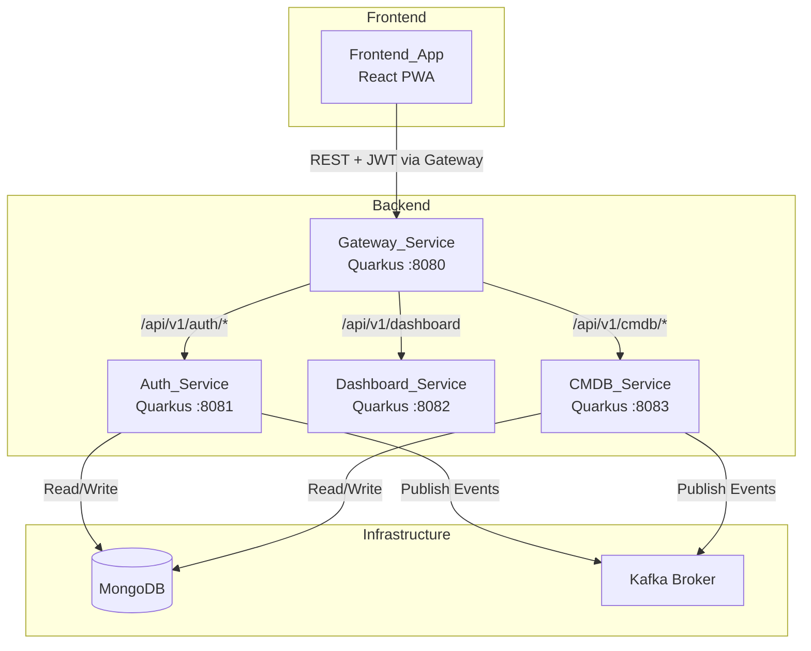
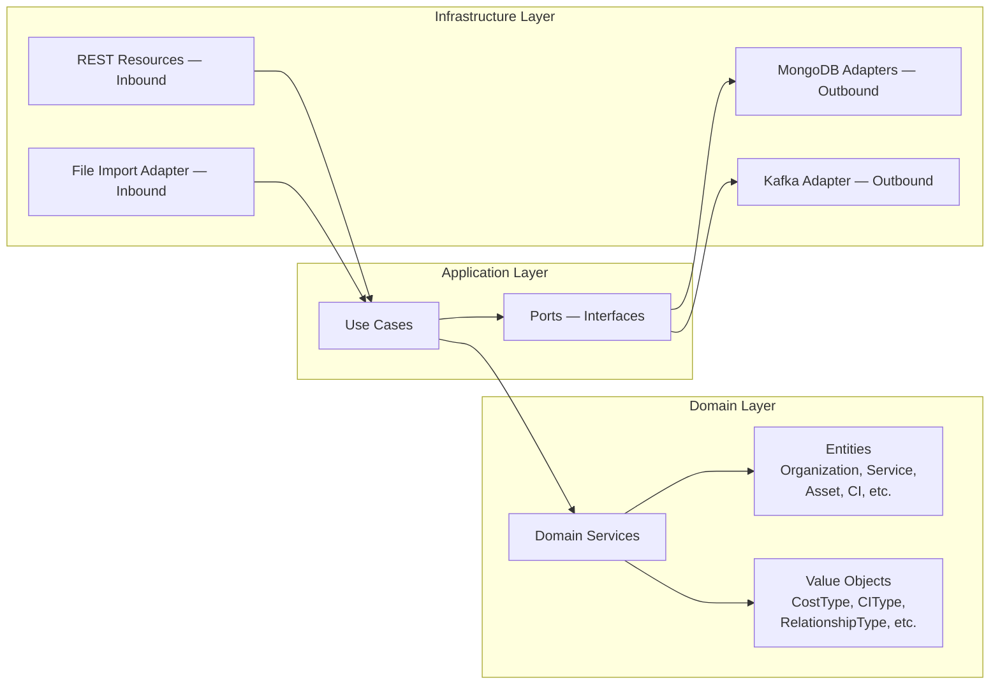

# Design Document

## Overview

This design introduces an Asset & Configuration Item (CI) Management System to the ZenAndOps ITSM platform via a new `cmdb-service` microservice. The service manages the full lifecycle of IT assets (financial perspective) and configuration items (operational perspective), models business services and their dependencies, maintains organizational hierarchy, and provides immutable versioning with traceable data origins.

The `cmdb-service` follows the same hexagonal architecture with DDD established by the `auth-service`, built on Java 25 with Quarkus 3.33.x and MongoDB. It integrates into the existing Docker Compose stack on port 8083, is routed through the `gateway-service`, publishes domain events to Kafka, and is instrumented with OpenTelemetry for full observability.

### Key Technical Decisions

| Decision | Choice | Rationale |
|---|---|---|
| Backend language/runtime | Java 25, Quarkus 3.33.x | Consistent with existing services; fast startup, reactive capabilities |
| Build tool | Maven | Consistent with existing services |
| Architecture | Hexagonal + DDD | Decouples domain logic from infrastructure; consistent with auth-service |
| Database | MongoDB (dedicated database) | Document-oriented storage fits flexible CI/asset attribute schemas; separate from auth DB |
| Messaging | Kafka (SmallRye Reactive Messaging) | Consistent with auth-service event publishing pattern |
| Package structure | `com.zenandops.cmdb` | Follows `com.zenandops.{service}` convention |
| Versioning strategy | Immutable append-only versions | Audit trail requirement; no updates/deletes on version records |
| Graph traversal | In-application BFS with depth limit | Avoids MongoDB graph query complexity; configurable max depth prevents runaway traversals |
| File import | Synchronous processing with partial failure | Simple implementation; returns summary with success/failure counts |
| Reconciliation | Name+type+org matching with reliability-based conflict resolution | Deterministic, auditable conflict resolution |
| Frontend | React 19 + TypeScript | Consistent with existing frontend-app |

---

## Architecture

### High-Level Architecture



### CMDB Service Hexagonal Architecture



### Service Communication

- Frontend_App → Gateway_Service → CMDB_Service: REST over HTTP with JWT Bearer tokens
- CMDB_Service → MongoDB: Direct connection via Quarkus MongoDB Panache client (dedicated `zenandops-cmdb` database)
- CMDB_Service → Kafka: Reactive Messaging via SmallRye for domain event publishing
- CMDB_Service reads JWT claims for user identity and role-based authorization

---

## Components and Interfaces

### CMDB_Service — Domain Layer

#### Entities

| Entity | Description |
|---|---|
| `Organization` | Hierarchical organizational unit (ROOT, BUSINESS_UNIT, DEPARTMENT, TEAM) |
| `Service` | Business or technical service with hierarchy, ownership, and criticality |
| `ServiceDependency` | Directed dependency between two services (SYNCHRONOUS, ASYNCHRONOUS, CRITICAL) |
| `Asset` | Financial entity (HARDWARE, SOFTWARE, CLOUD) with cost tracking |
| `AssetVersion` | Immutable snapshot of asset attributes at a point in time |
| `CI` | Operational component (VM, DATABASE, API, STORAGE, NETWORK) |
| `CIVersion` | Immutable snapshot of CI attributes at a point in time |
| `CIRelationship` | Directed relationship between CIs (DEPENDS_ON, HOSTS, CONNECTS_TO) |
| `ServiceCI` | Association linking a CI to a Service |
| `DataSource` | Registered data origin (API, AGENT, FILE) with reliability rating |
| `FileImportRecord` | Record of a file import operation with status and summary |
| `ReconciliationRecord` | Record of a reconciliation operation with report |

#### Value Objects / Enums

| Value Object | Values |
|---|---|
| `OrganizationType` | ROOT, BUSINESS_UNIT, DEPARTMENT, TEAM |
| `ServiceType` | DOMAIN, BUSINESS, TECHNICAL |
| `ServiceStatus` | ACTIVE, INACTIVE, DEPRECATED |
| `DependencyType` | SYNCHRONOUS, ASYNCHRONOUS, CRITICAL |
| `AssetType` | HARDWARE, SOFTWARE, CLOUD |
| `AssetStatus` | ACTIVE, INACTIVE, RETIRED |
| `CostType` | CAPEX, OPEX |
| `CIType` | VM, DATABASE, API, STORAGE, NETWORK |
| `CIStatus` | ACTIVE, INACTIVE, DECOMMISSIONED |
| `RelationshipType` | DEPENDS_ON, HOSTS, CONNECTS_TO |
| `DataOrigin` | API, AGENT, FILE |
| `DataSourceType` | API, AGENT, FILE |
| `CriticalityLevel` | LOW, MEDIUM, HIGH, CRITICAL |
| `ImportStatus` | COMPLETED, PARTIAL, FAILED |

#### Domain Exceptions

| Exception | Description |
|---|---|
| `OrganizationNotFoundException` | Organization ID not found |
| `OrganizationInUseException` | Organization has children, services, or assets |
| `DuplicateRootOrganizationException` | Attempt to create a second ROOT organization |
| `DuplicateSiblingNameException` | Sibling organization with same name under same parent |
| `ServiceNotFoundException` | Service ID not found |
| `ServiceInUseException` | Service has children, dependencies, or CI associations |
| `AssetNotFoundException` | Asset ID not found |
| `AssetInUseException` | Asset has CIs or active versions |
| `CINotFoundException` | CI ID not found |
| `CIInUseException` | CI has versions, relationships, or service associations |
| `DataSourceNotFoundException` | Data source ID not found |
| `DataSourceInUseException` | Data source referenced by versions |
| `DuplicateDataSourceNameException` | Data source name already exists |
| `DuplicateDependencyException` | Duplicate service dependency or CI relationship |
| `SelfReferenceException` | Source and target are the same entity |
| `DuplicateServiceCIException` | Duplicate service-CI association |
| `LastServiceAssociationException` | Cannot remove last service association from CI without exception flag |
| `ImmutableVersionException` | Attempt to update or delete a version record |
| `InvalidReliabilityRatingException` | Reliability rating outside 0-100 range |
| `InvalidFileFormatException` | Uploaded file format not supported or malformed |

### CMDB_Service — Application Layer (Ports)

#### Repository Ports

| Port | Description |
|---|---|
| `OrganizationRepository` | CRUD + tree queries for Organization entities |
| `ServiceRepository` | CRUD + hierarchy + filtering for Service entities |
| `ServiceDependencyRepository` | Create, delete, list dependencies between services |
| `AssetRepository` | CRUD + filtering + cost aggregation for Asset entities |
| `AssetVersionRepository` | Create, list (immutable) for Asset versions |
| `CIRepository` | CRUD + filtering for CI entities |
| `CIVersionRepository` | Create, list (immutable) for CI versions |
| `CIRelationshipRepository` | Create, delete, list relationships between CIs |
| `ServiceCIRepository` | Create, delete, list service-CI associations |
| `DataSourceRepository` | CRUD for data source entities |
| `FileImportRecordRepository` | Create, list for file import history |
| `ReconciliationRecordRepository` | Create, list for reconciliation history |

#### Outbound Ports

| Port | Description |
|---|---|
| `CmdbEventPublisher` | Publish domain events (asset, CI, service, version changes) to Kafka |

### CMDB_Service — Application Layer (Use Cases)

#### Organization Use Cases

| Use Case | Description |
|---|---|
| `CreateOrganizationUseCase` | Validates parent exists, enforces single ROOT, validates sibling name uniqueness |
| `GetOrganizationUseCase` | Retrieves organization by ID |
| `UpdateOrganizationUseCase` | Updates name/fields, validates sibling name uniqueness |
| `ListOrganizationsUseCase` | Lists all organizations |
| `DeleteOrganizationUseCase` | Validates no children/services/assets, then deletes |
| `GetOrganizationTreeUseCase` | Returns full organizational tree from ROOT |

#### Service Use Cases

| Use Case | Description |
|---|---|
| `CreateServiceUseCase` | Validates org and parent exist, enforces owners |
| `GetServiceUseCase` | Retrieves service by ID |
| `UpdateServiceUseCase` | Updates service fields |
| `ListServicesUseCase` | Lists services with filtering (org, type, criticality, status) |
| `DeleteServiceUseCase` | Validates no children/dependencies/CI associations |
| `GetServiceTreeUseCase` | Returns service hierarchy from root-level services |

#### Service Dependency Use Cases

| Use Case | Description |
|---|---|
| `CreateServiceDependencyUseCase` | Validates both services exist, prevents self-reference and duplicates, logs CRITICAL warning |
| `DeleteServiceDependencyUseCase` | Deletes a dependency |
| `ListServiceDependenciesUseCase` | Lists upstream and downstream dependencies for a service |

#### Asset Use Cases

| Use Case | Description |
|---|---|
| `CreateAssetUseCase` | Validates org exists, creates asset, publishes event |
| `GetAssetUseCase` | Retrieves asset by ID |
| `UpdateAssetUseCase` | Updates asset fields, publishes event |
| `ListAssetsUseCase` | Lists assets with filtering (org, type, cost type, status, supplier) |
| `DeleteAssetUseCase` | Validates no CIs or active versions |
| `GetAssetCostSummaryUseCase` | Returns total cost grouped by org and cost type |

#### Asset Version Use Cases

| Use Case | Description |
|---|---|
| `CreateAssetVersionUseCase` | Validates asset and data source exist, auto-assigns version number, closes previous version, publishes event |
| `ListAssetVersionsUseCase` | Returns version history ordered by version number |

#### CI Use Cases

| Use Case | Description |
|---|---|
| `CreateCIUseCase` | Validates org and optional asset exist, creates CI, publishes event |
| `GetCIUseCase` | Retrieves CI by ID |
| `UpdateCIUseCase` | Updates CI fields, publishes event |
| `ListCIsUseCase` | Lists CIs with filtering (org, type, status, asset) |
| `DeleteCIUseCase` | Validates no versions/relationships/service associations |

#### CI Version Use Cases

| Use Case | Description |
|---|---|
| `CreateCIVersionUseCase` | Validates CI and data source exist, auto-assigns version number, closes previous version, publishes event |
| `ListCIVersionsUseCase` | Returns version history ordered by version number |

#### CI Relationship Use Cases

| Use Case | Description |
|---|---|
| `CreateCIRelationshipUseCase` | Validates both CIs exist, prevents self-reference and duplicates |
| `DeleteCIRelationshipUseCase` | Deletes a relationship |
| `ListCIRelationshipsUseCase` | Lists upstream and downstream relationships for a CI |

#### Service-CI Use Cases

| Use Case | Description |
|---|---|
| `CreateServiceCIUseCase` | Validates service and CI exist, prevents duplicates |
| `DeleteServiceCIUseCase` | Validates not last association (unless exception flag) |
| `ListCIsByServiceUseCase` | Returns all CIs for a service |
| `ListServicesByCIUseCase` | Returns all services for a CI |

#### Data Source Use Cases

| Use Case | Description |
|---|---|
| `CreateDataSourceUseCase` | Validates name uniqueness and reliability rating range |
| `GetDataSourceUseCase` | Retrieves data source by ID |
| `UpdateDataSourceUseCase` | Updates data source fields |
| `ListDataSourcesUseCase` | Lists all data sources |
| `DeleteDataSourceUseCase` | Validates not referenced by any version |

#### File Import Use Cases

| Use Case | Description |
|---|---|
| `ImportFileUseCase` | Validates file format, processes records, creates assets/CIs and versions, returns summary |
| `ListFileImportsUseCase` | Returns import history |

#### Reconciliation Use Cases

| Use Case | Description |
|---|---|
| `TriggerReconciliationUseCase` | Compares records across data sources, resolves conflicts by reliability, returns report |
| `ListReconciliationsUseCase` | Returns reconciliation history |

#### Impact Analysis Use Cases

| Use Case | Description |
|---|---|
| `AnalyzeCIImpactUseCase` | BFS traversal of CI relationships + service-CI associations, returns affected CIs and services |
| `AnalyzeServiceImpactUseCase` | BFS traversal of service dependencies + associated CIs, returns affected services and CIs |

#### Historical Query Use Cases

| Use Case | Description |
|---|---|
| `GetAssetVersionAtTimeUseCase` | Finds the asset version active at a given timestamp |
| `GetCIVersionAtTimeUseCase` | Finds the CI version active at a given timestamp |

### CMDB_Service — Infrastructure Layer (REST Resources)

All endpoints are prefixed with `/api/v1/cmdb`.

#### OrganizationResource — `/api/v1/cmdb/organizations`

| Method | Path | Auth | Description |
|---|---|---|---|
| POST | `/organizations` | ADMIN, OPERATOR | Create organization |
| GET | `/organizations` | Authenticated | List organizations |
| GET | `/organizations/{id}` | Authenticated | Get organization by ID |
| PUT | `/organizations/{id}` | ADMIN, OPERATOR | Update organization |
| DELETE | `/organizations/{id}` | ADMIN, OPERATOR | Delete organization |
| GET | `/organizations/tree` | Authenticated | Get full organizational tree |

#### ServiceResource — `/api/v1/cmdb/services`

| Method | Path | Auth | Description |
|---|---|---|---|
| POST | `/services` | ADMIN, OPERATOR | Create service |
| GET | `/services` | Authenticated | List services (with filters) |
| GET | `/services/{id}` | Authenticated | Get service by ID |
| PUT | `/services/{id}` | ADMIN, OPERATOR | Update service |
| DELETE | `/services/{id}` | ADMIN, OPERATOR | Delete service |
| GET | `/services/tree` | Authenticated | Get service hierarchy tree |

#### ServiceDependencyResource — `/api/v1/cmdb/service-dependencies`

| Method | Path | Auth | Description |
|---|---|---|---|
| POST | `/service-dependencies` | ADMIN, OPERATOR | Create dependency |
| GET | `/service-dependencies?serviceId={id}` | Authenticated | List dependencies for a service |
| DELETE | `/service-dependencies/{id}` | ADMIN, OPERATOR | Delete dependency |

#### AssetResource — `/api/v1/cmdb/assets`

| Method | Path | Auth | Description |
|---|---|---|---|
| POST | `/assets` | ADMIN, OPERATOR | Create asset |
| GET | `/assets` | Authenticated | List assets (with filters) |
| GET | `/assets/{id}` | Authenticated | Get asset by ID |
| PUT | `/assets/{id}` | ADMIN, OPERATOR | Update asset |
| DELETE | `/assets/{id}` | ADMIN, OPERATOR | Delete asset |
| GET | `/assets/cost-summary` | Authenticated | Get cost summary by org and cost type |

#### AssetVersionResource — `/api/v1/cmdb/assets/{assetId}/versions`

| Method | Path | Auth | Description |
|---|---|---|---|
| POST | `/assets/{assetId}/versions` | ADMIN, OPERATOR | Create version |
| GET | `/assets/{assetId}/versions` | Authenticated | List version history |

#### CIResource — `/api/v1/cmdb/cis`

| Method | Path | Auth | Description |
|---|---|---|---|
| POST | `/cis` | ADMIN, OPERATOR | Create CI |
| GET | `/cis` | Authenticated | List CIs (with filters) |
| GET | `/cis/{id}` | Authenticated | Get CI by ID |
| PUT | `/cis/{id}` | ADMIN, OPERATOR | Update CI |
| DELETE | `/cis/{id}` | ADMIN, OPERATOR | Delete CI |

#### CIVersionResource — `/api/v1/cmdb/cis/{ciId}/versions`

| Method | Path | Auth | Description |
|---|---|---|---|
| POST | `/cis/{ciId}/versions` | ADMIN, OPERATOR | Create version |
| GET | `/cis/{ciId}/versions` | Authenticated | List version history |

#### CIRelationshipResource — `/api/v1/cmdb/ci-relationships`

| Method | Path | Auth | Description |
|---|---|---|---|
| POST | `/ci-relationships` | ADMIN, OPERATOR | Create relationship |
| GET | `/ci-relationships?ciId={id}` | Authenticated | List relationships for a CI |
| DELETE | `/ci-relationships/{id}` | ADMIN, OPERATOR | Delete relationship |

#### ServiceCIResource — `/api/v1/cmdb/service-cis`

| Method | Path | Auth | Description |
|---|---|---|---|
| POST | `/service-cis` | ADMIN, OPERATOR | Create association |
| GET | `/service-cis?serviceId={id}` | Authenticated | List CIs for a service |
| GET | `/service-cis?ciId={id}` | Authenticated | List services for a CI |
| DELETE | `/service-cis/{id}` | ADMIN, OPERATOR | Delete association |

#### DataSourceResource — `/api/v1/cmdb/data-sources`

| Method | Path | Auth | Description |
|---|---|---|---|
| POST | `/data-sources` | ADMIN, OPERATOR | Create data source |
| GET | `/data-sources` | Authenticated | List data sources |
| GET | `/data-sources/{id}` | Authenticated | Get data source by ID |
| PUT | `/data-sources/{id}` | ADMIN, OPERATOR | Update data source |
| DELETE | `/data-sources/{id}` | ADMIN, OPERATOR | Delete data source |

#### FileImportResource — `/api/v1/cmdb/imports`

| Method | Path | Auth | Description |
|---|---|---|---|
| POST | `/imports` | ADMIN, OPERATOR | Upload and process file |
| GET | `/imports` | Authenticated | List import history |

#### ReconciliationResource — `/api/v1/cmdb/reconciliations`

| Method | Path | Auth | Description |
|---|---|---|---|
| POST | `/reconciliations` | ADMIN, OPERATOR | Trigger reconciliation |
| GET | `/reconciliations` | Authenticated | List reconciliation history |

#### ImpactAnalysisResource — `/api/v1/cmdb/impact-analysis`

| Method | Path | Auth | Description |
|---|---|---|---|
| GET | `/impact-analysis/ci/{ciId}` | Authenticated | Analyze CI impact |
| GET | `/impact-analysis/service/{serviceId}` | Authenticated | Analyze service impact |

#### HistoricalQueryResource — `/api/v1/cmdb/history`

| Method | Path | Auth | Description |
|---|---|---|---|
| GET | `/history/assets/{assetId}?at={timestamp}` | Authenticated | Get asset version at time |
| GET | `/history/cis/{ciId}?at={timestamp}` | Authenticated | Get CI version at time |

### Gateway_Service — Route Additions

New route definitions added to `ConfigRouteResolver`:

```java
// CMDB Service routes (protected)
definitions.add(new RouteDefinition("/api/v1/cmdb", cmdbServiceUrl, true));
```

New configuration property:
```properties
gateway.cmdb-service.url=http://localhost:8083
```

### Frontend_App — New Pages

#### Organization Management Page (`/cmdb/organizations`)

- Tree view displaying organizational hierarchy with parent-child relationships
- Create form: name, type (dropdown), parent organization (dropdown), responsible person, cost center
- Inline editing for name, responsible person, cost center
- Delete with in-use error feedback
- ADMIN/OPERATOR access

#### Service Management Page (`/cmdb/services`)

- Table view: name, type, organization, criticality, status, business owner, technical owner
- Create/edit form with all required fields
- Dependency list per service showing source, target, dependency type
- Add dependency form with dropdowns
- Filtering by organization, type, criticality, status
- ADMIN/OPERATOR write access, all authenticated read access

#### Asset Management Page (`/cmdb/assets`)

- Table view: name, type, organization, cost, cost type, status, supplier
- Create/edit form with all required fields
- Version history panel for selected asset
- Filtering by organization, type, cost type, status, supplier
- ADMIN/OPERATOR write access, all authenticated read access

#### CI Management Page (`/cmdb/cis`)

- Table view: name, type, organization, status, associated asset
- Create/edit form with all required fields
- Version history panel for selected CI
- Relationship list showing source, target, relationship type
- Filtering by organization, type, status, asset
- ADMIN/OPERATOR write access, all authenticated read access

#### Impact Analysis Page (`/cmdb/impact-analysis`)

- Search field to select a CI or Service
- Structured result list showing affected entities, relationship paths, total counts
- Visual distinction between directly and transitively affected entities

#### File Import Page (`/cmdb/imports`)

- File upload component accepting CSV, JSON, XML
- Import summary display: successful, failed, error details
- Import history list

### Frontend_App — New Hooks

```typescript
useOrganizationApi() → { create, get, update, delete, list, getTree }
useServiceApi() → { create, get, update, delete, list, getTree }
useServiceDependencyApi() → { create, delete, listByService }
useAssetApi() → { create, get, update, delete, list, getCostSummary }
useAssetVersionApi() → { create, listByAsset }
useCIApi() → { create, get, update, delete, list }
useCIVersionApi() → { create, listByCI }
useCIRelationshipApi() → { create, delete, listByCI }
useServiceCIApi() → { create, delete, listByService, listByCI }
useDataSourceApi() → { create, get, update, delete, list }
useFileImportApi() → { upload, listHistory }
useReconciliationApi() → { trigger, listHistory }
useImpactAnalysisApi() → { analyzeCI, analyzeService }
useHistoricalQueryApi() → { getAssetVersionAt, getCIVersionAt }
```

### Frontend_App — Sidebar Updates

New navigation group added to `navItems` in `AppSidebar.tsx`:

```typescript
{
  icon: <BoxIcon />,
  name: "CMDB",
  subItems: [
    { name: "Organizations", path: "/cmdb/organizations" },
    { name: "Services", path: "/cmdb/services" },
    { name: "Assets", path: "/cmdb/assets" },
    { name: "Configuration Items", path: "/cmdb/cis" },
    { name: "Impact Analysis", path: "/cmdb/impact-analysis" },
    { name: "File Import", path: "/cmdb/imports" },
  ],
}
```

### Frontend_App — Route Updates

New routes added in `App.tsx`:

```tsx
<Route path="/cmdb/organizations" element={<OrganizationManagement />} />
<Route path="/cmdb/services" element={<ServiceManagement />} />
<Route path="/cmdb/assets" element={<AssetManagement />} />
<Route path="/cmdb/cis" element={<CIManagement />} />
<Route path="/cmdb/impact-analysis" element={<ImpactAnalysis />} />
<Route path="/cmdb/imports" element={<FileImport />} />
```

---

## Data Models

### Organization Collection (MongoDB — `zenandops-cmdb` database)

```json
{
  "_id": "ObjectId",
  "name": "string",
  "type": "ROOT | BUSINESS_UNIT | DEPARTMENT | TEAM",
  "parentId": "ObjectId | null",
  "responsiblePerson": "string",
  "costCenter": "string",
  "createdAt": "ISODate",
  "updatedAt": "ISODate"
}
```

Indexes: `{ parentId: 1 }`, `{ type: 1 }`, `{ parentId: 1, name: 1 }` (unique — enforces sibling name uniqueness)

### Service Collection

```json
{
  "_id": "ObjectId",
  "name": "string",
  "description": "string",
  "type": "DOMAIN | BUSINESS | TECHNICAL",
  "parentId": "ObjectId | null",
  "organizationId": "ObjectId",
  "businessOwner": "string",
  "technicalOwner": "string",
  "criticality": "LOW | MEDIUM | HIGH | CRITICAL",
  "status": "ACTIVE | INACTIVE | DEPRECATED",
  "createdAt": "ISODate",
  "updatedAt": "ISODate"
}
```

Indexes: `{ organizationId: 1 }`, `{ parentId: 1 }`, `{ type: 1 }`, `{ criticality: 1 }`, `{ status: 1 }`

### ServiceDependency Collection

```json
{
  "_id": "ObjectId",
  "sourceServiceId": "ObjectId",
  "targetServiceId": "ObjectId",
  "dependencyType": "SYNCHRONOUS | ASYNCHRONOUS | CRITICAL",
  "createdAt": "ISODate"
}
```

Indexes: `{ sourceServiceId: 1 }`, `{ targetServiceId: 1 }`, `{ sourceServiceId: 1, targetServiceId: 1 }` (unique)

### Asset Collection

```json
{
  "_id": "ObjectId",
  "name": "string",
  "type": "HARDWARE | SOFTWARE | CLOUD",
  "organizationId": "ObjectId",
  "cost": "Decimal128",
  "costType": "CAPEX | OPEX",
  "acquisitionDate": "ISODate",
  "status": "ACTIVE | INACTIVE | RETIRED",
  "supplier": "string",
  "createdAt": "ISODate",
  "updatedAt": "ISODate"
}
```

Indexes: `{ organizationId: 1 }`, `{ type: 1 }`, `{ costType: 1 }`, `{ status: 1 }`, `{ supplier: 1 }`

### AssetVersion Collection

```json
{
  "_id": "ObjectId",
  "assetId": "ObjectId",
  "versionNumber": "int",
  "description": "string",
  "attributes": "Document (JSON)",
  "startDate": "ISODate",
  "endDate": "ISODate | null",
  "dataOrigin": "API | AGENT | FILE",
  "dataSourceId": "ObjectId",
  "changeReference": "string | null",
  "createdAt": "ISODate"
}
```

Indexes: `{ assetId: 1, versionNumber: 1 }` (unique), `{ assetId: 1, endDate: 1 }`, `{ dataSourceId: 1 }`

### CI Collection

```json
{
  "_id": "ObjectId",
  "name": "string",
  "type": "VM | DATABASE | API | STORAGE | NETWORK",
  "organizationId": "ObjectId",
  "assetId": "ObjectId | null",
  "status": "ACTIVE | INACTIVE | DECOMMISSIONED",
  "controlledExceptionFlag": "boolean (default: false)",
  "createdAt": "ISODate",
  "updatedAt": "ISODate"
}
```

Indexes: `{ organizationId: 1 }`, `{ type: 1 }`, `{ status: 1 }`, `{ assetId: 1 }`

### CIVersion Collection

```json
{
  "_id": "ObjectId",
  "ciId": "ObjectId",
  "versionNumber": "int",
  "attributes": "Document (JSON)",
  "startDate": "ISODate",
  "endDate": "ISODate | null",
  "dataOrigin": "API | AGENT | FILE",
  "dataSourceId": "ObjectId",
  "changeReference": "string | null",
  "createdAt": "ISODate"
}
```

Indexes: `{ ciId: 1, versionNumber: 1 }` (unique), `{ ciId: 1, endDate: 1 }`, `{ dataSourceId: 1 }`

### CIRelationship Collection

```json
{
  "_id": "ObjectId",
  "sourceCIId": "ObjectId",
  "targetCIId": "ObjectId",
  "relationshipType": "DEPENDS_ON | HOSTS | CONNECTS_TO",
  "createdAt": "ISODate"
}
```

Indexes: `{ sourceCIId: 1 }`, `{ targetCIId: 1 }`, `{ sourceCIId: 1, targetCIId: 1, relationshipType: 1 }` (unique)

### ServiceCI Collection

```json
{
  "_id": "ObjectId",
  "serviceId": "ObjectId",
  "ciId": "ObjectId",
  "createdAt": "ISODate"
}
```

Indexes: `{ serviceId: 1 }`, `{ ciId: 1 }`, `{ serviceId: 1, ciId: 1 }` (unique)

### DataSource Collection

```json
{
  "_id": "ObjectId",
  "name": "string (unique)",
  "type": "API | AGENT | FILE",
  "reliabilityRating": "int (0-100)",
  "createdAt": "ISODate",
  "updatedAt": "ISODate"
}
```

Indexes: `{ name: 1 }` (unique)

### FileImportRecord Collection

```json
{
  "_id": "ObjectId",
  "fileName": "string",
  "fileFormat": "CSV | JSON | XML",
  "dataSourceId": "ObjectId",
  "status": "COMPLETED | PARTIAL | FAILED",
  "totalRecords": "int",
  "successCount": "int",
  "failureCount": "int",
  "errors": [
    {
      "recordIndex": "int",
      "field": "string",
      "message": "string"
    }
  ],
  "importedBy": "string",
  "createdAt": "ISODate"
}
```

### ReconciliationRecord Collection

```json
{
  "_id": "ObjectId",
  "entityType": "ASSET | CI",
  "recordsAnalyzed": "int",
  "duplicatesFound": "int",
  "conflictsResolved": "int",
  "unresolvedConflicts": "int",
  "details": [
    {
      "entityId": "ObjectId",
      "entityName": "string",
      "conflictType": "DUPLICATE | ATTRIBUTE_MISMATCH",
      "resolution": "AUTO_RESOLVED | MANUAL_REVIEW",
      "preferredSourceId": "ObjectId | null"
    }
  ],
  "triggeredBy": "string",
  "createdAt": "ISODate"
}
```

### Kafka CMDB Event

```json
{
  "eventId": "UUID",
  "eventType": "ASSET_CREATED | ASSET_UPDATED | CI_CREATED | CI_UPDATED | SERVICE_CREATED | SERVICE_UPDATED | VERSION_CREATED",
  "entityId": "string",
  "entityType": "ASSET | CI | SERVICE | ASSET_VERSION | CI_VERSION",
  "userId": "string",
  "timestamp": "ISODate",
  "metadata": {}
}
```

Kafka topic: `cmdb-events`

### Impact Analysis Response

```json
{
  "rootEntity": {
    "id": "string",
    "name": "string",
    "type": "CI | SERVICE"
  },
  "affectedEntities": [
    {
      "id": "string",
      "name": "string",
      "entityType": "CI | SERVICE",
      "relationshipPath": ["string"],
      "depth": "int"
    }
  ],
  "totalAffectedServices": "int",
  "totalAffectedCIs": "int",
  "circularDependencyWarnings": ["string"],
  "maxDepthReached": "boolean"
}
```

### Environment Variables (New)

| Variable | Default | Description |
|---|---|---|
| `CMDB_SERVICE_PORT` | `8083` | CMDB service exposed host port |
| `CMDB_DB_NAME` | `zenandops-cmdb` | MongoDB database name for CMDB service |
| `GATEWAY_CMDB_SERVICE_URL` | `http://cmdb-service:8083` | Gateway route to CMDB service |
| `CMDB_IMPACT_ANALYSIS_MAX_DEPTH` | `10` | Maximum traversal depth for impact analysis |

---

## Correctness Properties

*A property is a characteristic or behavior that should hold true across all valid executions of a system — essentially, a formal statement about what the system should do. Properties serve as the bridge between human-readable specifications and machine-verifiable correctness guarantees.*

### Property 1: Organization CRUD Round-Trip

*For any* valid Organization data (name, type, parent, responsible person, cost center), creating the Organization and then retrieving it by ID should return an entity with all fields matching the input, including the auto-generated creation timestamp.

**Validates: Requirements 1.1, 1.2**

### Property 2: Service CRUD Round-Trip

*For any* valid Service data (name, description, type, parent, organization, business owner, technical owner, criticality, status), creating the Service and then retrieving it by ID should return an entity with all fields matching the input.

**Validates: Requirements 2.1, 2.2**

### Property 3: Asset CRUD Round-Trip

*For any* valid Asset data (name, type, organization, cost, cost type, acquisition date, status, supplier), creating the Asset and then retrieving it by ID should return an entity with all fields matching the input.

**Validates: Requirements 4.1, 4.2**

### Property 4: CI CRUD Round-Trip

*For any* valid CI data (name, type, organization, optional asset, status), creating the CI and then retrieving it by ID should return an entity with all fields matching the input.

**Validates: Requirements 6.1, 6.2**

### Property 5: DataSource CRUD Round-Trip

*For any* valid DataSource data (name, type, reliability rating between 0-100), creating the DataSource and then retrieving it by ID should return an entity with all fields matching the input.

**Validates: Requirements 10.1, 10.2**

### Property 6: Foreign Reference Validation

*For any* entity creation request that includes a reference to a non-existent parent entity (Organization parent, Service parent, Service organization, Asset organization, CI organization, CI asset, version asset/CI, version data source, dependency source/target service, relationship source/target CI, service-CI service/CI), the system SHALL reject the request with an appropriate error.

**Validates: Requirements 1.3, 2.3, 2.4, 3.3, 4.3, 5.3, 5.7, 6.3, 6.4, 7.3, 7.7, 8.3, 9.2**

### Property 7: Self-Reference Prevention

*For any* service dependency or CI relationship creation where the source and target reference the same entity, the system SHALL reject the request.

**Validates: Requirements 3.4, 8.4**

### Property 8: Name Uniqueness Enforcement

*For any* two entities of the same type sharing a uniqueness scope (Organization siblings under the same parent, DataSource names globally), attempting to create the second with a duplicate name SHALL be rejected.

**Validates: Requirements 1.8, 10.3**

### Property 9: Relationship Uniqueness Enforcement

*For any* existing relationship (ServiceDependency between source and target, CIRelationship between source, target, and type, ServiceCI between service and CI), attempting to create a duplicate SHALL be rejected.

**Validates: Requirements 3.5, 8.5, 9.3**

### Property 10: Deletion Protection for Entities with Dependents

*For any* entity that has dependent records (Organization with children/services/assets, Service with children/dependencies/CI associations, Asset with CIs or active versions, CI with versions/relationships/service associations, DataSource referenced by versions), attempting to delete it SHALL be rejected with an error indicating the entity is in use.

**Validates: Requirements 1.6, 2.6, 4.5, 6.6, 10.4**

### Property 11: Single ROOT Organization Invariant

*For any* system state where a ROOT Organization already exists, attempting to create another Organization of type ROOT SHALL be rejected.

**Validates: Requirements 1.4, 1.5**

### Property 12: Service Owner Enforcement

*For any* Service creation request missing either a business owner or a technical owner, the system SHALL reject the request.

**Validates: Requirements 2.5**

### Property 13: Version Immutability

*For any* existing AssetVersion or CIVersion record, attempting to update or delete it SHALL be rejected.

**Validates: Requirements 5.5, 7.5**

### Property 14: Version Auto-Increment

*For any* sequence of N versions created for the same Asset or CI, the version numbers SHALL be assigned as 1, 2, ..., N in creation order.

**Validates: Requirements 5.4, 7.4**

### Property 15: Previous Version Closure

*For any* Asset or CI with an existing active version (endDate is null), when a new version is created, the previous version's endDate SHALL be set to the new version's startDate.

**Validates: Requirements 5.6, 7.6**

### Property 16: Version History Ordering

*For any* Asset or CI with multiple versions, the version history endpoint SHALL return versions ordered by version number ascending.

**Validates: Requirements 5.8, 7.8**

### Property 17: Hierarchy Tree Completeness

*For any* set of Organizations (or Services) with parent-child relationships, the tree endpoint SHALL return a structure containing every entity exactly once, with correct parent-child nesting.

**Validates: Requirements 1.7, 2.7**

### Property 18: Filter Result Correctness

*For any* collection of Services, Assets, or CIs with varied attributes, and *for any* filter criteria (organization, type, status, criticality, cost type, supplier), every entity in the filtered result SHALL match all specified filter criteria.

**Validates: Requirements 2.8, 4.4, 6.5**

### Property 19: Bidirectional Relationship Listing

*For any* entity (Service or CI) with relationships in both directions, the listing endpoint SHALL return all relationships where the entity is either source or target.

**Validates: Requirements 3.6, 8.6, 9.4, 9.5**

### Property 20: Last Service Association Protection

*For any* CI that has exactly one ServiceCI association and does not have the controlled exception flag set, attempting to delete that association SHALL be rejected. If the CI has the controlled exception flag set, the deletion SHALL succeed.

**Validates: Requirements 9.6, 6.7**

### Property 21: Reliability Rating Range Validation

*For any* integer value outside the range [0, 100], attempting to create or update a DataSource with that reliability rating SHALL be rejected.

**Validates: Requirements 10.5**

### Property 22: Asset Cost Summary Accuracy

*For any* set of Assets with known costs, the cost summary endpoint SHALL return totals that equal the sum of individual asset costs when grouped by organization and cost type.

**Validates: Requirements 4.6**

### Property 23: Impact Analysis Transitive Completeness

*For any* CI or Service and its dependency graph, the impact analysis SHALL return all entities reachable via transitive traversal of relationships (CI_Relationship or Service_Dependency), up to the configured maximum depth.

**Validates: Requirements 13.1, 13.2, 13.3**

### Property 24: Impact Analysis Circular Dependency Detection

*For any* dependency graph containing a cycle, the impact analysis SHALL detect the cycle, terminate traversal for that path, include a warning in the response, and still return all non-cyclic reachable entities.

**Validates: Requirements 13.5**

### Property 25: Historical Point-in-Time Query

*For any* Asset or CI with a sequence of versions with known start/end dates, and *for any* timestamp, the historical query SHALL return the version whose startDate is on or before the timestamp and whose endDate is after the timestamp or is null. If no such version exists, it SHALL return 404.

**Validates: Requirements 14.1, 14.2, 14.3, 14.4**

### Property 26: Reconciliation Conflict Resolution by Reliability

*For any* two versions of the same entity (matched by name, type, and organization) from different DataSources, reconciliation SHALL prefer the version from the DataSource with the higher reliability rating.

**Validates: Requirements 12.2, 12.3**

### Property 27: File Import Partial Failure Summary

*For any* import file containing a mix of valid and invalid records, the import summary SHALL report successCount equal to the number of valid records processed and failureCount equal to the number of invalid records skipped, with specific error details for each failure.

**Validates: Requirements 11.5**

### Property 28: RBAC Write Operation Enforcement

*For any* write operation (create, update, delete) on any CMDB endpoint, the request SHALL be rejected with 403 if the authenticated user does not have the ADMIN or OPERATOR role. Read operations SHALL succeed for any authenticated user.

**Validates: Requirements 16.2, 16.3, 16.4**

---

## Error Handling

### CMDB_Service Error Responses

| Scenario | HTTP Status | Error Code | Description |
|---|---|---|---|
| Organization not found | 404 | `CMDB_ORGANIZATION_NOT_FOUND` | Organization ID does not exist |
| Organization in use | 409 | `CMDB_ORGANIZATION_IN_USE` | Organization has children, services, or assets |
| Duplicate ROOT organization | 409 | `CMDB_DUPLICATE_ROOT` | A ROOT organization already exists |
| Duplicate sibling name | 409 | `CMDB_DUPLICATE_SIBLING_NAME` | Sibling with same name under same parent |
| Service not found | 404 | `CMDB_SERVICE_NOT_FOUND` | Service ID does not exist |
| Service in use | 409 | `CMDB_SERVICE_IN_USE` | Service has children, dependencies, or CI associations |
| Asset not found | 404 | `CMDB_ASSET_NOT_FOUND` | Asset ID does not exist |
| Asset in use | 409 | `CMDB_ASSET_IN_USE` | Asset has CIs or active versions |
| CI not found | 404 | `CMDB_CI_NOT_FOUND` | CI ID does not exist |
| CI in use | 409 | `CMDB_CI_IN_USE` | CI has versions, relationships, or service associations |
| Data source not found | 404 | `CMDB_DATASOURCE_NOT_FOUND` | Data source ID does not exist |
| Data source in use | 409 | `CMDB_DATASOURCE_IN_USE` | Data source referenced by versions |
| Duplicate data source name | 409 | `CMDB_DUPLICATE_DATASOURCE_NAME` | Data source name already exists |
| Duplicate dependency | 409 | `CMDB_DUPLICATE_DEPENDENCY` | Dependency already exists between source and target |
| Duplicate relationship | 409 | `CMDB_DUPLICATE_RELATIONSHIP` | CI relationship already exists |
| Duplicate service-CI | 409 | `CMDB_DUPLICATE_SERVICE_CI` | Service-CI association already exists |
| Self-reference | 400 | `CMDB_SELF_REFERENCE` | Source and target are the same entity |
| Last service association | 409 | `CMDB_LAST_SERVICE_ASSOCIATION` | Cannot remove last service link from CI |
| Immutable version | 400 | `CMDB_IMMUTABLE_VERSION` | Cannot update or delete version records |
| Invalid reliability rating | 400 | `CMDB_INVALID_RELIABILITY_RATING` | Rating outside 0-100 range |
| Invalid file format | 400 | `CMDB_INVALID_FILE_FORMAT` | Unsupported or malformed file |
| Missing required field | 400 | `CMDB_VALIDATION_ERROR` | Required field missing or invalid |
| Unauthorized | 401 | `CMDB_UNAUTHORIZED` | Missing or invalid JWT |
| Forbidden | 403 | `CMDB_FORBIDDEN` | User lacks required role |
| Kafka unavailable | N/A (logged) | `CMDB_EVENT_PUBLISH_FAILED` | Event publishing failure; request continues |

### Error Response Format

Consistent with existing services:

```json
{
  "error": {
    "code": "CMDB_ORGANIZATION_NOT_FOUND",
    "message": "Organization with ID '...' not found",
    "timestamp": "2026-01-15T10:30:00Z"
  }
}
```

### Frontend Error Handling

| Scenario | Behavior |
|---|---|
| 401 on API call | Trigger token refresh → retry → redirect to login on failure |
| 403 on write operation | Display "Insufficient permissions" message |
| 404 on entity lookup | Display "Entity not found" message |
| 409 conflict | Display server-provided error message (e.g., "Organization is in use") |
| File import partial failure | Display summary with success/failure counts and error details |
| Network error | Display generic connection error notification |
| Impact analysis cycle warning | Display warning badge alongside results |

---

## Testing Strategy

### Testing Approach

This feature uses a dual testing approach:

- **Property-based tests** verify universal correctness properties across many generated inputs (minimum 100 iterations per property)
- **Example-based unit tests** verify specific scenarios, edge cases, and UI behavior
- **Integration tests** verify Kafka event publishing, file import processing, and end-to-end flows
- **Smoke tests** verify Docker Compose startup, gateway routing, and service connectivity

### Property-Based Testing

**Library:** [jqwik](https://jqwik.net/) for Java (integrates with JUnit 5 and Quarkus), consistent with existing services.

Each property test:
- Runs a minimum of 100 iterations with randomly generated inputs
- References its design document property via a tag comment
- Tag format: `Feature: asset-ci-management, Property {number}: {property_text}`

**Maven dependency** (added to `cmdb-service/pom.xml`):
```xml
<dependency>
    <groupId>net.jqwik</groupId>
    <artifactId>jqwik</artifactId>
    <version>1.9.3</version>
    <scope>test</scope>
</dependency>
```

### Property Test Coverage

| Property | Test Focus | Key Generators |
|---|---|---|
| 1-5 | CRUD round-trips per entity | Random valid entity data |
| 6 | Foreign reference validation | Random non-existent ObjectId references |
| 7 | Self-reference prevention | Random entity IDs used as both source and target |
| 8 | Name uniqueness | Random strings for duplicate name attempts |
| 9 | Relationship uniqueness | Random valid relationships duplicated |
| 10 | Deletion protection | Entities with randomly generated dependents |
| 11 | Single ROOT invariant | Random ROOT creation attempts |
| 12 | Service owner enforcement | Random service data with missing owners |
| 13 | Version immutability | Random update/delete attempts on existing versions |
| 14 | Version auto-increment | Random sequences of version creations |
| 15 | Previous version closure | Sequential version creation with date verification |
| 16 | Version history ordering | Multiple versions with random data |
| 17 | Hierarchy tree completeness | Random tree structures |
| 18 | Filter result correctness | Random entities with varied attributes and filter combinations |
| 19 | Bidirectional relationship listing | Random relationships in both directions |
| 20 | Last service association protection | CIs with single association and varied exception flags |
| 21 | Reliability rating range | Random integers including out-of-range values |
| 22 | Cost summary accuracy | Random assets with known costs |
| 23 | Impact analysis completeness | Random dependency graphs |
| 24 | Circular dependency detection | Random graphs with injected cycles |
| 25 | Historical point-in-time query | Random version sequences with known date ranges |
| 26 | Reconciliation conflict resolution | Random entities from sources with different reliability |
| 27 | File import partial failure | Random files with mixed valid/invalid records |
| 28 | RBAC enforcement | Random requests with varied roles |

### Unit Tests (Example-Based)

| Area | Tests |
|---|---|
| Organization | Single ROOT creation, tree with single node, empty tree |
| Service | Service with all criticality levels, status transitions |
| Asset | Zero-cost asset, cost summary with no assets |
| CI | CI with and without asset reference, controlled exception flag behavior |
| Version | First version for entity (no previous to close), version with null endDate |
| Impact Analysis | Empty graph, single node, linear chain, fan-out |
| Historical Query | Query before first version, query after last version, query at exact boundary |
| File Import | Empty file, single valid record, all invalid records |
| Reconciliation | No duplicates found, all conflicts auto-resolved |
| Data Source | Boundary reliability values (0, 100) |

### Integration Tests

| Area | Tests |
|---|---|
| Kafka Events | Create/update asset, CI, service → verify event on `cmdb-events` topic |
| Kafka Resilience | Kafka down → verify request succeeds, failure logged |
| File Import E2E | Upload CSV/JSON/XML → verify records created in MongoDB |
| Gateway Routing | Request through gateway → verify reaches CMDB service |
| JWT Validation | Request without token → 401; with valid token → success |

### Smoke Tests

| Area | Tests |
|---|---|
| Docker Compose | CMDB service starts, connects to MongoDB, health check passes |
| Gateway Route | `/api/v1/cmdb/organizations` reachable through gateway |
| MongoDB | CMDB database and collections created |
| OTel | CMDB service exports telemetry to OTel Collector |
