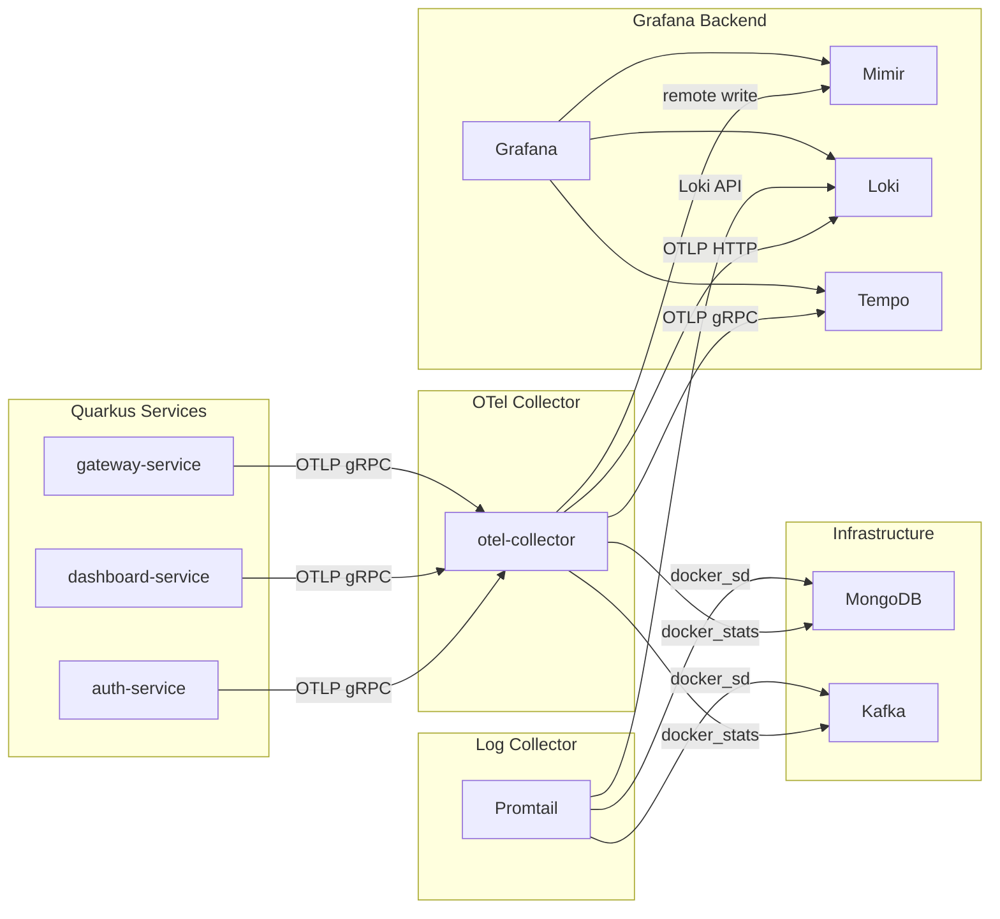
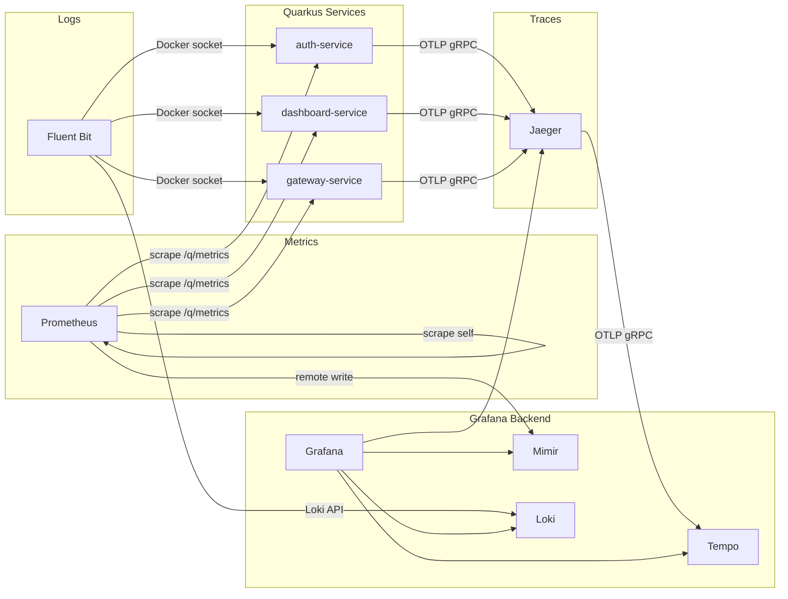
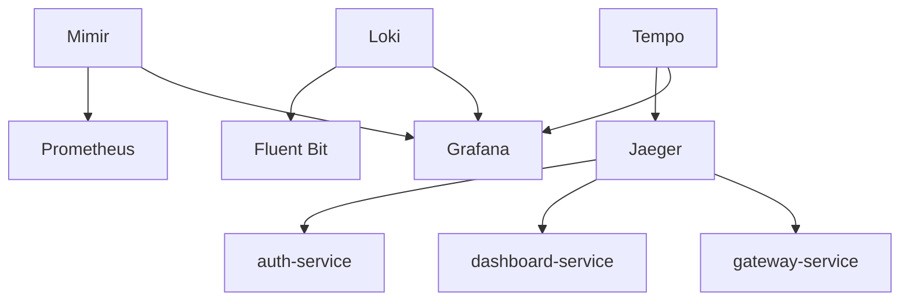

# Design Document

## Overview

This design describes the migration of the ZenAndOps observability stack from an OpenTelemetry Collector-centric architecture to a purpose-built toolchain. The migration replaces two components (OTel Collector and Promtail) with three dedicated collectors (Prometheus, Fluent Bit, Jaeger), each handling a single telemetry signal. The Grafana backend stack (Mimir, Loki, Tempo, Grafana) remains unchanged.

### Current Architecture



### Target Architecture



### Design Rationale

| Decision | Rationale |
|---|---|
| Replace OTel Collector with purpose-built tools | Each telemetry signal gets a dedicated, well-understood collector. Reduces configuration complexity and single-point-of-failure risk. |
| Prometheus for metrics (pull-based) | Native Prometheus scraping aligns with Micrometer's Prometheus registry already available in Quarkus. Eliminates the OTLP-to-remote-write translation layer. |
| Fluent Bit for logs | Lightweight (~450KB), native Docker log collection via Docker socket, built-in Loki output plugin. Replaces both OTel Collector log pipeline and Promtail. |
| Jaeger v2 for traces | Native OTLP support (no protocol translation needed), built-in UI for trace visualization, forwards to Tempo via OTLP gRPC. Jaeger v2 is based on the OTel Collector framework. |
| Keep Grafana backend unchanged | Mimir, Loki, Tempo, and Grafana continue to serve as the long-term storage and dashboarding layer. No changes needed to their configurations. |

## Architecture

### Component Topology

The observability stack follows a three-signal separation pattern:

1. **Metrics signal**: Prometheus scrapes HTTP endpoints → remote writes to Mimir
2. **Logs signal**: Fluent Bit reads Docker socket → pushes to Loki HTTP API
3. **Traces signal**: Quarkus services send OTLP gRPC → Jaeger receives and forwards to Tempo via OTLP gRPC

### Service Dependency Graph



Dependencies flow as `depends_on` in Docker Compose:
- **Prometheus** depends on Mimir (started)
- **Fluent Bit** depends on Loki (healthy)
- **Jaeger** depends on Tempo (healthy)
- **Each Quarkus service** depends on Jaeger (started)
- **Grafana** retains existing dependencies on Loki, Mimir, Tempo

### Network

All services remain on the existing `zenandops-net` bridge network. No new networks are introduced.

## Components and Interfaces

### Prometheus Service

| Property | Value |
|---|---|
| Image | `prom/prometheus:v3.4.1` |
| Container name | `zenandops-prometheus` |
| Exposed port | `${PROMETHEUS_PORT:-9090}:9090` |
| Volume | `prometheus-data:/prometheus` |
| Config mount | `./observability/prometheus.yml:/etc/prometheus/prometheus.yml` |
| Health check | `wget --no-verbose --tries=1 --spider http://localhost:9090/-/ready` |
| Depends on | `mimir` (started) |

**Configuration file** (`observability/prometheus.yml`):

```yaml
global:
  scrape_interval: 15s
  evaluation_interval: 15s

remote_write:
  - url: http://mimir:9009/api/v1/push

scrape_configs:
  - job_name: prometheus
    static_configs:
      - targets: ["localhost:9090"]

  - job_name: auth-service
    metrics_path: /q/metrics
    static_configs:
      - targets: ["auth-service:8081"]

  - job_name: dashboard-service
    metrics_path: /q/metrics
    static_configs:
      - targets: ["dashboard-service:8082"]

  - job_name: gateway-service
    metrics_path: /q/metrics
    static_configs:
      - targets: ["gateway-service:8080"]
```

Key behaviors:
- Scrapes all Quarkus services at `/q/metrics` every 15 seconds
- Scrapes its own internal metrics
- Remote writes all metrics to Mimir at `http://mimir:9009/api/v1/push`
- When a target is temporarily unavailable, Prometheus marks it as `DOWN` and continues scraping other targets without interruption

### Fluent Bit Service

| Property | Value |
|---|---|
| Image | `fluent/fluent-bit:4.0` |
| Container name | `zenandops-fluent-bit` |
| Exposed port | `${FLUENT_BIT_MONITOR_PORT:-2020}:2020` |
| Volume mount | `/var/run/docker.sock:/var/run/docker.sock:ro` |
| Config mount | `./observability/fluent-bit.conf:/fluent-bit/etc/fluent-bit.conf` |
| Health check | `wget --no-verbose --tries=1 --spider http://localhost:2020/api/v1/health` |
| Depends on | `loki` (healthy) |

**Configuration file** (`observability/fluent-bit.conf`):

```ini
[SERVICE]
    Flush        1
    Log_Level    info
    HTTP_Server  On
    HTTP_Listen  0.0.0.0
    HTTP_Port    2020
    Health_Check On

[INPUT]
    Name         tail
    Tag          docker.*
    Path         /var/lib/docker/containers/*/*.log
    Parser       docker
    Docker_Mode  On
    Refresh_Interval 10
    Mem_Buf_Limit 5MB
    Skip_Long_Lines On

[FILTER]
    Name         parser
    Match        docker.*
    Key_Name     log
    Parser       json_parser
    Reserve_Data On

[OUTPUT]
    Name         loki
    Match        docker.*
    Host         loki
    Port         3100
    Labels       job=fluent-bit
    Auto_Kubernetes_Labels Off
    Line_Format  json
```

**Parsers file** (`observability/fluent-bit-parsers.conf`):

```ini
[PARSER]
    Name         docker
    Format       json
    Time_Key     time
    Time_Format  %Y-%m-%dT%H:%M:%S.%L%z

[PARSER]
    Name         json_parser
    Format       json
    Time_Key     timestamp
    Time_Format  %Y-%m-%dT%H:%M:%S.%L%z
```

Key behaviors:
- Collects logs from all Docker containers by tailing the Docker JSON log files
- Parses JSON-formatted log lines from Quarkus services to extract structured fields
- Forwards all logs to Loki at `http://loki:3100/loki/api/v1/push`
- Enriches log entries with container metadata (container name, service name) via the Docker JSON log format
- Exposes port 2020 for the built-in HTTP monitoring endpoint
- If the Docker socket or log path is unavailable, Fluent Bit logs an error

### Jaeger Service

| Property | Value |
|---|---|
| Image | `jaegertracing/jaeger:2.6.0` |
| Container name | `zenandops-jaeger` |
| Exposed ports | `${JAEGER_UI_PORT:-16686}:16686`, `${JAEGER_OTLP_GRPC_PORT:-4317}:4317`, `4318:4318` |
| Config mount | `./observability/jaeger-config.yaml:/etc/jaeger/config.yaml` |
| Health check | `wget --no-verbose --tries=1 --spider http://localhost:13133/` |
| Depends on | `tempo` (healthy) |

Jaeger v2 is built on the OpenTelemetry Collector framework and uses a YAML configuration file following the OTel Collector config schema.

**Configuration file** (`observability/jaeger-config.yaml`):

```yaml
service:
  extensions: [jaeger_storage, jaeger_query, healthcheckv2]
  pipelines:
    traces:
      receivers: [otlp]
      processors: [batch]
      exporters: [otlp/tempo]

extensions:
  healthcheckv2:
    http:
      endpoint: 0.0.0.0:13133
  jaeger_storage:
    backends:
      memory:
        memory:
          max-traces: 10000
  jaeger_query:
    storage:
      traces: memory
    ui:
      config_file: ""

receivers:
  otlp:
    protocols:
      grpc:
        endpoint: 0.0.0.0:4317
      http:
        endpoint: 0.0.0.0:4318

processors:
  batch:
    timeout: 5s
    send_batch_size: 1024

exporters:
  otlp/tempo:
    endpoint: tempo:4317
    tls:
      insecure: true
```

Key behaviors:
- Accepts traces via OTLP gRPC (port 4317) and OTLP HTTP (port 4318)
- Forwards all traces to Tempo via OTLP gRPC at `tempo:4317`
- Stores recent traces in memory (up to 10,000) for the Jaeger query UI
- Exposes the Jaeger UI on port 16686
- Health check via the OTel health check extension on port 13133

### Quarkus Service Changes

Each Quarkus service (auth-service, dashboard-service, gateway-service) requires the following changes:

1. **OTEL_EXPORTER_OTLP_ENDPOINT**: Change from `http://otel-collector:4317` to `http://jaeger:4317`
2. **depends_on**: Replace `otel-collector` with `jaeger` (condition: `service_started`)
3. **Metrics endpoint**: Already exposed at `/q/metrics` via Micrometer Prometheus registry (no code changes needed)

### Grafana Datasource Update

Add a Jaeger datasource to `observability/grafana/provisioning/datasources/datasources.yaml`:

```yaml
  - name: Jaeger
    type: jaeger
    access: proxy
    uid: jaeger
    url: http://jaeger:16686
```

All existing datasources (Mimir, Loki, Tempo) remain unchanged.

### Environment Variable Changes

**Remove:**
- `OTEL_COLLECTOR_PORT_GRPC`
- `OTEL_COLLECTOR_PORT_HTTP`
- `OTEL_EXPORTER_OTLP_ENDPOINT=http://otel-collector:4317`

**Add:**
- `PROMETHEUS_PORT=9090`
- `JAEGER_UI_PORT=16686`
- `JAEGER_OTLP_GRPC_PORT=4317`
- `FLUENT_BIT_MONITOR_PORT=2020`
- `OTEL_EXPORTER_OTLP_ENDPOINT=http://jaeger:4317`

### Files to Remove

- `observability/otel-collector-config.yaml`
- `observability/promtail-config.yaml`

### Files to Create

- `observability/prometheus.yml`
- `observability/fluent-bit.conf`
- `observability/fluent-bit-parsers.conf`
- `observability/jaeger-config.yaml`

## Data Models

### Telemetry Data Flow

| Signal | Source | Collector | Protocol | Backend | Storage |
|---|---|---|---|---|---|
| Metrics | Quarkus `/q/metrics` | Prometheus | HTTP scrape → remote write | Mimir | Time-series (TSDB) |
| Metrics | Prometheus self | Prometheus | HTTP scrape → remote write | Mimir | Time-series (TSDB) |
| Logs | Docker containers | Fluent Bit | Docker JSON logs → Loki HTTP API | Loki | Log chunks (filesystem) |
| Traces | Quarkus OTLP | Jaeger | OTLP gRPC → OTLP gRPC | Tempo | Trace blocks (filesystem) |

### Port Allocation

| Service | Port | Purpose |
|---|---|---|
| Prometheus | 9090 | Web UI and API |
| Fluent Bit | 2020 | HTTP monitoring endpoint |
| Jaeger | 16686 | Query UI |
| Jaeger | 4317 | OTLP gRPC receiver |
| Jaeger | 4318 | OTLP HTTP receiver |
| Jaeger | 13133 | Health check |

### Docker Volumes

New named volume:
- `prometheus-data` — Prometheus TSDB data

Removed volumes (no longer needed):
- None (OTel Collector and Promtail did not use named volumes)

## Error Handling

| Scenario | Behavior |
|---|---|
| Quarkus service temporarily down | Prometheus marks target as `DOWN`, continues scraping other targets. Metrics resume when service recovers. |
| Mimir unavailable | Prometheus buffers metrics locally in its WAL (Write-Ahead Log) and retries remote write with exponential backoff. |
| Loki unavailable | Fluent Bit retries log delivery based on its retry configuration. Logs are buffered in memory up to `Mem_Buf_Limit`. |
| Tempo unavailable | Jaeger buffers traces in its batch processor and retries export. Recent traces remain queryable from Jaeger's in-memory store. |
| Docker socket unavailable | Fluent Bit logs an error for the tail input. No logs are collected until the socket becomes available. |
| Jaeger unavailable | Quarkus services log OTLP export failures but continue operating. Traces are lost until Jaeger recovers. |
| Circular dependency | Docker Compose validates the dependency graph at startup. The designed dependency chain is acyclic. |

## Testing Strategy

### Why Property-Based Testing Does Not Apply

This feature is an infrastructure configuration migration involving Docker Compose service definitions, YAML configuration files, and environment variable changes. There is no application logic, no pure functions, no parsers, and no serializers to test with property-based testing. The changes are declarative configurations, not code with input/output behavior.

### Testing Approach

**Smoke Tests** (manual or scripted):
1. Run `docker compose config` to validate the Compose file syntax and variable interpolation
2. Run `docker compose up -d` and verify all services reach healthy/running state
3. Verify no circular dependency errors on startup

**Integration Tests**:
1. **Metrics pipeline**: Verify Prometheus scrapes targets by querying `http://localhost:9090/api/v1/targets` and confirming all Quarkus services are in `UP` state
2. **Metrics storage**: Query Mimir via Grafana to confirm metrics like `http_server_requests_seconds` are present
3. **Logs pipeline**: Generate application activity and verify logs appear in Loki via Grafana's Explore view
4. **Traces pipeline**: Send a request through the gateway and verify the trace appears in both Jaeger UI (`http://localhost:16686`) and Tempo via Grafana
5. **Grafana datasources**: Verify all four datasources (Mimir, Loki, Tempo, Jaeger) are configured and reachable in Grafana's datasource settings

**Regression Tests**:
1. Verify existing Grafana dashboards continue to display data without modification
2. Confirm metric names from Prometheus scraping match the Micrometer-generated names previously exported via OTLP (e.g., `http_server_requests_seconds`, `jvm_memory_used_bytes`)
3. Verify the Tempo datasource configuration in Grafana (traces-to-logs, traces-to-metrics links) still functions correctly

**Validation Checks**:
1. Confirm `otel-collector-config.yaml` and `promtail-config.yaml` are removed from the repository
2. Confirm no references to `otel-collector` remain in `docker-compose.yml` or `.env`
3. Confirm all Quarkus services point `OTEL_EXPORTER_OTLP_ENDPOINT` to `http://jaeger:4317`
