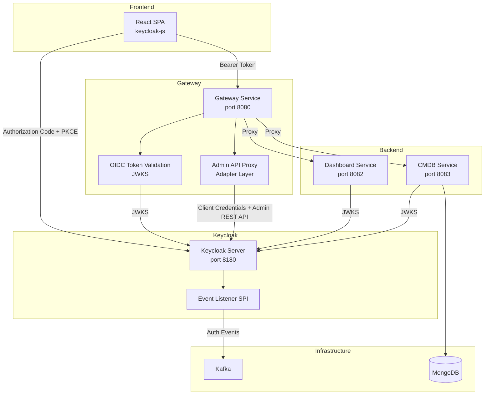
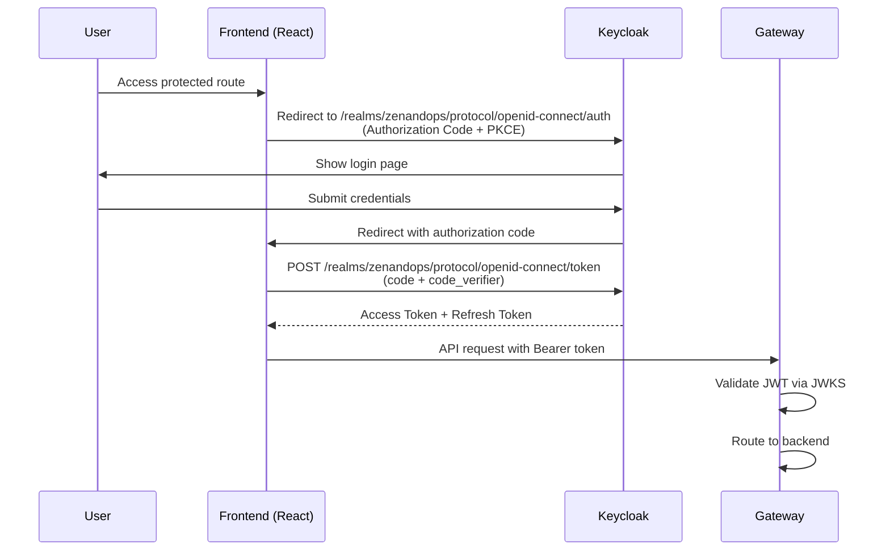
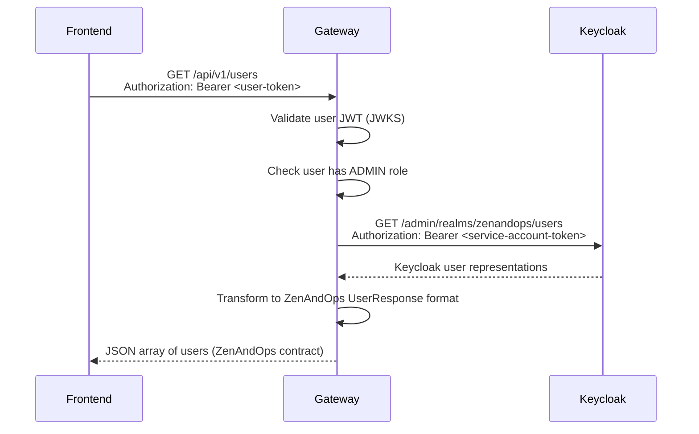

# Design Document: Keycloak Auth Delegation

## Overview

This design describes the complete migration of ZenAndOps authentication and user management from a custom auth-service to Keycloak as the centralized Identity and Access Management (IAM) provider. The migration involves:

1. **Adding Keycloak** to the Docker Compose infrastructure with a pre-configured realm JSON
2. **Removing the auth-service** entirely from the codebase
3. **Adapting the Gateway Service** to proxy user/role/tag/profile management requests to the Keycloak Admin REST API
4. **Switching all backend services** from inline RSA public key JWT validation to Keycloak OIDC/JWKS-based validation
5. **Replacing the frontend auth flow** from custom login forms with `keycloak-js` Authorization Code Flow with PKCE
6. **Preserving Kafka auth events** via a custom Keycloak Event Listener SPI JAR

The key architectural shift is that Keycloak becomes the single source of truth for identity, credentials, roles, and user attributes (tags). The Gateway Service acts as an adapter layer, translating ZenAndOps REST API contracts into Keycloak Admin REST API calls so that the frontend and other consumers remain unaffected.

### Research Summary

- **Quarkus OIDC**: The `quarkus-oidc` extension replaces `quarkus-smallrye-jwt` for token validation. It supports automatic JWKS discovery via `quarkus.oidc.auth-server-url` pointing to `http://keycloak:8180/realms/zenandops`. Key caching and rotation are handled automatically. ([Quarkus OIDC Guide](https://quarkus.io/guides/security-openid-connect-dev-services))
- **Keycloak Event Listener SPI**: Keycloak provides `EventListenerProvider` and `EventListenerProviderFactory` interfaces. A custom JAR implementing these interfaces can intercept LOGIN, LOGOUT, and REFRESH_TOKEN events and publish them to Kafka. The JAR is deployed by placing it in `/opt/keycloak/providers/`. ([DZone: Publish Keycloak Events to Kafka](https://dzone.com/articles/publish-keycloak-events-to-kafka-with-a-custom-spi))
- **keycloak-js**: The official JavaScript adapter supports Authorization Code Flow with PKCE out of the box. It manages token lifecycle (init, login, logout, refresh) and stores tokens in memory by default. ([keycloak-js GitHub](https://github.com/keycloak/keycloak-js))
- **Keycloak Realm Import**: The `--import-realm` startup flag imports a JSON file from `/opt/keycloak/data/import/`. The JSON can include realm config, clients, roles, users with credentials, protocol mappers, and user attributes. ([Keycloak Import/Export Docs](https://www.keycloak.org/server/importExport))
- **Quarkus OIDC Client**: The `quarkus-oidc-client` extension provides a programmatic way to obtain service account tokens for backend-to-Keycloak Admin API calls using client credentials flow. ([Quarkus OIDC Client Reference](https://quarkus.io/guides/security-openid-connect-client-reference))

### Design Decisions

| Decision | Choice | Rationale |
|---|---|---|
| Tag definition storage | Keycloak realm attributes (JSON in `_zenandops_tags` attribute) | Tags are a custom concept not native to Keycloak. Realm attributes provide a simple key-value store without requiring a separate database. The gateway reads/writes this attribute via the Admin REST API. |
| Permission aggregation | Script-based protocol mapper | Permissions are stored as role attributes and must be aggregated across all assigned roles into a single JWT claim. A custom script mapper iterates over the user's realm roles and collects their `permissions` attributes. |
| Gateway-to-Keycloak auth | `quarkus-oidc-client` with client credentials | The gateway needs a service account token to call the Keycloak Admin REST API. The `quarkus-oidc-client` extension handles token acquisition and refresh automatically. |
| Frontend token storage | In-memory (keycloak-js default) | More secure than localStorage. The `keycloak-js` adapter manages tokens in memory and handles refresh automatically. |
| Keycloak image | `quay.io/keycloak/keycloak:26.2` | Latest stable release with full SPI support and realm import capabilities. |
| SPI build tool | Maven (standalone module) | Consistent with the rest of the Java codebase. Produces a single JAR with Kafka client dependency shaded in. |

## Architecture

### High-Level Architecture (Post-Migration)



### Request Flow: Authentication (Login)



### Request Flow: Admin API Proxy (e.g., List Users)



## Components and Interfaces

### 1. Keycloak Realm Configuration (`keycloak/zenandops-realm.json`)

A JSON file defining the complete realm configuration, imported on Keycloak startup.

**Responsibilities:**
- Define the `zenandops` realm with appropriate settings
- Register the `zenandops-frontend` public client (PKCE enabled)
- Register the `zenandops-backend` confidential client (service account enabled)
- Define protocol mappers for custom JWT claims (`userId`, `name`, `email`, `roles`, `tags`, `permissions`)
- Define realm roles (`ADMIN`, `USER`, `GUEST`) with permission attributes
- Seed default users (`admin`, `user`, `guest`) with credentials, role assignments, and tag attributes
- Configure token lifespans (access: 15 min, refresh: 8 hours)
- Store tag definitions as a realm attribute

### 2. Keycloak Event Listener SPI (`keycloak-event-listener/`)

A standalone Maven module producing a JAR deployed into Keycloak's providers directory.

**Responsibilities:**
- Implement `EventListenerProvider` to intercept `LOGIN`, `LOGOUT`, and `REFRESH_TOKEN` events
- Implement `EventListenerProviderFactory` to configure the provider
- Publish events to the Kafka `auth-events` topic in the existing `AuthEvent` JSON schema
- Read Kafka bootstrap servers from environment variable `KAFKA_BOOTSTRAP_SERVERS`
- Handle Kafka unavailability gracefully (log and continue)

**Interfaces:**

```java
// EventListenerProvider implementation
public class KafkaEventListenerProvider implements EventListenerProvider {
    void onEvent(Event event);           // Handles LOGIN, LOGOUT, REFRESH_TOKEN
    void onEvent(AdminEvent event, boolean includeRepresentation); // No-op
    void close();
}

// EventListenerProviderFactory implementation
public class KafkaEventListenerProviderFactory implements EventListenerProviderFactory {
    EventListenerProvider create(KeycloakSession session);
    void init(Config.Scope config);
    void postInit(KeycloakSessionFactory factory);
    void close();
    String getId();  // Returns "zenandops-kafka-event-listener"
}
```

**Kafka Event Schema (preserved from current auth-service):**

```json
{
  "eventId": "uuid-string",
  "eventType": "LOGIN | LOGOFF | TOKEN_REFRESH",
  "userId": "keycloak-user-id",
  "userLogin": "username",
  "timestamp": "2025-01-15T10:30:00Z"
}
```

### 3. Gateway Service — OIDC Adapter Layer

The gateway gains new components for Keycloak integration while preserving its existing proxy and rate-limiting architecture.

#### 3a. KeycloakAdminClient (`infrastructure/adapter/keycloak/KeycloakAdminClient.java`)

A REST client that communicates with the Keycloak Admin REST API using service account credentials.

**Responsibilities:**
- Obtain and cache service account tokens via `quarkus-oidc-client`
- Provide typed methods for Keycloak Admin REST API operations (users, roles, realm attributes)
- Handle token refresh transparently

**Interface:**

```java
@ApplicationScoped
public class KeycloakAdminClient {
    // User operations
    List<KeycloakUserRepresentation> listUsers(Integer first, Integer max);
    KeycloakUserRepresentation getUser(String userId);
    KeycloakUserRepresentation createUser(KeycloakUserRepresentation user);
    void updateUser(String userId, KeycloakUserRepresentation user);
    void deleteUser(String userId);

    // Role mapping operations
    List<KeycloakRoleRepresentation> getUserRealmRoles(String userId);
    void assignRealmRoles(String userId, List<KeycloakRoleRepresentation> roles);
    void removeRealmRoles(String userId, List<KeycloakRoleRepresentation> roles);

    // Role operations
    List<KeycloakRoleRepresentation> listRealmRoles();
    KeycloakRoleRepresentation getRealmRole(String roleName);
    KeycloakRoleRepresentation getRealmRoleById(String roleId);
    void createRealmRole(KeycloakRoleRepresentation role);
    void updateRealmRole(String roleId, KeycloakRoleRepresentation role);
    void deleteRealmRole(String roleId);

    // Realm attribute operations (for tag definitions)
    Map<String, String> getRealmAttributes();
    void updateRealmAttributes(Map<String, String> attributes);

    // User attribute operations (for user tag assignments)
    Map<String, List<String>> getUserAttributes(String userId);
    void updateUserAttributes(String userId, Map<String, List<String>> attributes);

    // Password operations
    void resetPassword(String userId, String newPassword, boolean temporary);
}
```

#### 3b. Response Translators

Adapter classes that convert between Keycloak Admin REST API representations and ZenAndOps REST API contracts.

**UserResponseTranslator:**
- `KeycloakUserRepresentation` → `UserResponse` (id, login, name, email, roles, tagIds, active, createdAt, updatedAt)
- `CreateUserRequest` → `KeycloakUserRepresentation`
- `UpdateUserRequest` → partial `KeycloakUserRepresentation`

**RoleResponseTranslator:**
- `KeycloakRoleRepresentation` → `RoleResponse` (id, name, description, permissions, createdAt, updatedAt)
- `CreateRoleRequest` → `KeycloakRoleRepresentation` with `permissions` attribute
- `UpdateRoleRequest` → partial `KeycloakRoleRepresentation`

**TagResponseTranslator:**
- Realm attribute JSON → `TagResponse` (id, key, value, description, createdAt, updatedAt)
- `CreateTagRequest` → tag definition JSON entry

#### 3c. Admin Proxy Resources

New JAX-RS resources that handle the proxied management endpoints. These replace the simple pass-through proxy for auth-service routes.

```
UserAdminResource       → /api/v1/users, /api/v1/users/{id}
UserRoleAdminResource   → /api/v1/users/{userId}/roles
UserTagAdminResource    → /api/v1/users/{userId}/tags
RoleAdminResource       → /api/v1/roles, /api/v1/roles/{id}
TagAdminResource        → /api/v1/tags, /api/v1/tags/{id}
ProfileResource         → /api/v1/profile, /api/v1/profile/password
```

These resources are dedicated JAX-RS endpoints (not pass-through proxy). They:
1. Validate the user's JWT and check for required permissions
2. Call `KeycloakAdminClient` to perform the operation
3. Use response translators to convert Keycloak responses to ZenAndOps format
4. Return the translated response

#### 3d. Updated Route Resolver

The `ConfigRouteResolver` is updated to:
- Remove all routes pointing to `auth-service.url`
- Remove the `gateway.auth-service.url` config property
- Keep dashboard and CMDB routes unchanged
- The new admin proxy resources are handled directly by JAX-RS (not via the catch-all proxy)

### 4. Frontend — keycloak-js Integration

#### 4a. Keycloak Initialization (`src/lib/keycloak.ts`)

```typescript
import Keycloak from "keycloak-js";

const keycloak = new Keycloak({
  url: import.meta.env.VITE_KEYCLOAK_URL,
  realm: import.meta.env.VITE_KEYCLOAK_REALM,
  clientId: import.meta.env.VITE_KEYCLOAK_CLIENT_ID,
});

export default keycloak;
```

#### 4b. Updated AuthContext (`src/context/AuthContext.tsx`)

The `AuthProvider` is rewritten to use `keycloak-js` instead of manual token management:

- `login()` → `keycloak.login()` (redirects to Keycloak)
- `logoff()` → `keycloak.logout()` (terminates SSO session)
- `refreshTokens()` → `keycloak.updateToken(60)` (auto-refresh with 60s buffer)
- Token storage: in-memory via keycloak-js (removes localStorage usage)
- User claims: parsed from `keycloak.tokenParsed` (userId, name, email, roles, tags, permissions)
- The `useAuth` hook interface remains unchanged for backward compatibility

#### 4c. Axios Interceptor Update

The axios request interceptor is updated to use `keycloak.token` instead of reading from localStorage:

```typescript
axios.interceptors.request.use((config) => {
  if (keycloak.token) {
    config.headers.Authorization = `Bearer ${keycloak.token}`;
  }
  return config;
});
```

### 5. Backend Services — OIDC Migration

#### Dashboard Service and CMDB Service

Both services replace `quarkus-smallrye-jwt` with `quarkus-oidc`:

**Dependency change (pom.xml):**
- Remove: `quarkus-smallrye-jwt`
- Add: `quarkus-oidc`

**Configuration change (application.properties):**
- Remove: `mp.jwt.verify.publickey`, `mp.jwt.verify.issuer`
- Add: `quarkus.oidc.auth-server-url`, `quarkus.oidc.client-id`, `quarkus.oidc.tls.verification=none`

The `@Authenticated` and `@RolesAllowed` annotations continue to work unchanged because `quarkus-oidc` provides the same `SecurityIdentity` abstraction.

#### Gateway Service

The gateway also switches from `quarkus-smallrye-jwt` to `quarkus-oidc`, plus adds `quarkus-oidc-client` for service account token management:

**Dependency changes (pom.xml):**
- Remove: `quarkus-smallrye-jwt`
- Add: `quarkus-oidc`, `quarkus-oidc-client`, `quarkus-rest-client-jackson`

**Configuration additions (application.properties):**
```properties
# OIDC token validation
quarkus.oidc.auth-server-url=http://keycloak:8180/realms/zenandops
quarkus.oidc.client-id=zenandops-backend
quarkus.oidc.credentials.secret=${KEYCLOAK_BACKEND_CLIENT_SECRET}
quarkus.oidc.tls.verification=none

# OIDC client for Admin REST API calls
quarkus.oidc-client.auth-server-url=http://keycloak:8180/realms/zenandops
quarkus.oidc-client.client-id=zenandops-backend
quarkus.oidc-client.credentials.secret=${KEYCLOAK_BACKEND_CLIENT_SECRET}
quarkus.oidc-client.grant.type=client_credentials

# Keycloak Admin REST API base URL
gateway.keycloak.admin-url=http://keycloak:8180/admin/realms/zenandops
```

## Data Models

### Keycloak Realm JSON Structure

The realm JSON file (`keycloak/zenandops-realm.json`) follows the Keycloak realm export format:

```json
{
  "realm": "zenandops",
  "enabled": true,
  "accessTokenLifespan": 900,
  "ssoSessionMaxLifespan": 28800,
  "attributes": {
    "_zenandops_tags": "[{\"id\":\"...\",\"key\":\"department\",\"value\":\"engineering\",\"description\":\"Engineering department\"}, ...]"
  },
  "roles": {
    "realm": [
      {
        "name": "ADMIN",
        "description": "Full system access",
        "attributes": {
          "permissions": "[\"users:read\",\"users:write\",\"roles:read\",\"roles:write\",\"tags:read\",\"tags:write\",\"profile:read\",\"profile:write\",\"dashboard:read\"]"
        }
      }
    ]
  },
  "clients": [
    {
      "clientId": "zenandops-frontend",
      "publicClient": true,
      "standardFlowEnabled": true,
      "directAccessGrantsEnabled": false,
      "redirectUris": ["http://localhost:3000/*"],
      "webOrigins": ["http://localhost:3000"],
      "attributes": { "pkce.code.challenge.method": "S256" },
      "protocolMappers": [ "..." ]
    },
    {
      "clientId": "zenandops-backend",
      "publicClient": false,
      "serviceAccountsEnabled": true,
      "clientAuthenticatorType": "client-secret",
      "secret": "${KEYCLOAK_BACKEND_CLIENT_SECRET}"
    }
  ],
  "users": [
    {
      "username": "admin",
      "enabled": true,
      "firstName": "Administrator",
      "email": "admin@zenandops.com",
      "emailVerified": true,
      "credentials": [{ "type": "password", "value": "admin", "temporary": false }],
      "realmRoles": ["ADMIN", "USER"],
      "attributes": {
        "tags": ["[{\"key\":\"department\",\"value\":\"engineering\"},{\"key\":\"location\",\"value\":\"HQ\"}]"]
      }
    }
  ]
}
```

### Protocol Mappers

| Mapper Name | Type | Claim | Source | Token Type |
|---|---|---|---|---|
| `userId-mapper` | `oidc-usermodel-attribute-mapper` | `userId` | User ID (`sub`) | Access Token |
| `name-mapper` | `oidc-full-name-mapper` | `name` | firstName + lastName | Access Token |
| `email-mapper` | `oidc-usermodel-property-mapper` | `email` | User email | Access Token |
| `roles-mapper` | `oidc-usermodel-realm-role-mapper` | `roles` | Realm roles | Access Token |
| `tags-mapper` | `oidc-usermodel-attribute-mapper` | `tags` | User attribute `tags` | Access Token |
| `permissions-mapper` | `oidc-script-based-protocol-mapper` | `permissions` | Aggregated from role attributes | Access Token |

### Tag Definition Storage Model

Tag definitions are stored as a JSON array in the Keycloak realm attribute `_zenandops_tags`:

```json
[
  {
    "id": "uuid-1",
    "key": "department",
    "value": "engineering",
    "description": "Engineering department",
    "createdAt": "2025-01-15T10:00:00Z",
    "updatedAt": "2025-01-15T10:00:00Z"
  },
  {
    "id": "uuid-2",
    "key": "department",
    "value": "operations",
    "description": "Operations department",
    "createdAt": "2025-01-15T10:00:00Z",
    "updatedAt": "2025-01-15T10:00:00Z"
  }
]
```

### User Tag Assignment Model

User tag assignments are stored as a Keycloak user attribute `tags` containing a JSON array:

```json
[
  { "key": "department", "value": "engineering" },
  { "key": "location", "value": "HQ" }
]
```

### Gateway Response Translation Models

The gateway translates between Keycloak representations and ZenAndOps API contracts:

**Keycloak UserRepresentation → ZenAndOps UserResponse:**

| Keycloak Field | ZenAndOps Field | Notes |
|---|---|---|
| `id` | `id` | Keycloak UUID |
| `username` | `login` | Direct mapping |
| `firstName` | `name` | Maps firstName to name |
| `email` | `email` | Direct mapping |
| `enabled` | `active` | Direct mapping |
| `realmRoles` (via role-mappings API) | `roles` | Requires separate API call |
| `attributes.tags` | `tagIds` | Resolved from tag definitions |
| `createdTimestamp` | `createdAt` | Epoch millis → ISO 8601 |
| N/A | `updatedAt` | Not natively tracked by Keycloak; use `createdTimestamp` as fallback |

**Keycloak RoleRepresentation → ZenAndOps RoleResponse:**

| Keycloak Field | ZenAndOps Field | Notes |
|---|---|---|
| `id` | `id` | Keycloak UUID |
| `name` | `name` | Direct mapping |
| `description` | `description` | Direct mapping |
| `attributes.permissions` | `permissions` | JSON array stored as role attribute |

### Docker Compose Changes

**Added:**
- `keycloak` service (quay.io/keycloak/keycloak:26.2, port 8180, health check, realm import)
- Volume mount for realm JSON: `./keycloak/zenandops-realm.json:/opt/keycloak/data/import/zenandops-realm.json`
- Volume mount for SPI JAR: `./keycloak-event-listener/target/keycloak-event-listener.jar:/opt/keycloak/providers/keycloak-event-listener.jar`

**Removed:**
- `auth-service` service definition
- All `MP_JWT_VERIFY_PUBLICKEY`, `MP_JWT_VERIFY_ISSUER`, `SMALLRYE_JWT_*`, `ZENANDOPS_JWT_*` environment variables
- `GATEWAY_AUTH_SERVICE_URL`, `AUTH_SERVICE_PORT`, `AUTH_DB_NAME` environment variables

**Modified:**
- `gateway-service`: depends on `keycloak` instead of `auth-service`, adds OIDC env vars
- `dashboard-service`: adds OIDC env vars, removes JWT env vars
- `cmdb-service`: adds OIDC env vars, removes JWT env vars
- `frontend-app`: adds `VITE_KEYCLOAK_URL`, `VITE_KEYCLOAK_REALM`, `VITE_KEYCLOAK_CLIENT_ID` build args


## Correctness Properties

*A property is a characteristic or behavior that should hold true across all valid executions of a system — essentially, a formal statement about what the system should do. Properties serve as the bridge between human-readable specifications and machine-verifiable correctness guarantees.*

The following properties focus on the adapter and translation logic in the Gateway Service and the Event Listener SPI — the core custom code in this migration. Infrastructure configuration (Docker Compose, realm JSON structure, application.properties) is validated via smoke and integration tests, not property-based tests.

### Property 1: Response translation preserves all user fields

*For any* valid Keycloak `UserRepresentation` with a username, firstName, email, enabled flag, createdTimestamp, and associated realm roles and tag attributes, translating it to a ZenAndOps `UserResponse` should produce a response where `login` equals `username`, `name` equals `firstName`, `email` equals `email`, `active` equals `enabled`, `roles` contains all realm role names, and `createdAt` is the ISO 8601 representation of `createdTimestamp`.

**Validates: Requirements 7.5, 7.12**

### Property 2: Response translation preserves all role fields

*For any* valid Keycloak `RoleRepresentation` with a name, description, id, and a `permissions` attribute containing a JSON array of permission strings, translating it to a ZenAndOps `RoleResponse` should produce a response where `id`, `name`, and `description` are preserved, and `permissions` is the parsed JSON array matching the original permission strings.

**Validates: Requirements 7.8, 7.12**

### Property 3: Tag definition storage round-trip

*For any* list of valid tag definitions (each with id, key, value, description, createdAt, updatedAt), serializing them to the realm attribute JSON format and then deserializing back should produce an equivalent list of tag definitions with all fields preserved.

**Validates: Requirements 7.9**

### Property 4: User tag assignment round-trip

*For any* list of tag assignments (each with key and value strings), serializing them to the Keycloak user attribute format and then deserializing back should produce an equivalent list of tag assignments.

**Validates: Requirements 7.7**

### Property 5: Auth event serialization contains all required fields

*For any* valid auth event with a non-empty eventId (UUID), eventType (LOGIN, LOGOFF, or TOKEN_REFRESH), userId, userLogin, and timestamp (ISO 8601), serializing the event to JSON should produce a string that, when parsed back, contains all five fields with their original values.

**Validates: Requirements 6.4**

### Property 6: Keycloak error status mapping

*For any* Keycloak Admin REST API error response with an HTTP status code in {400, 401, 403, 404, 409, 500}, the gateway error mapper should return an HTTP response with an appropriate status code (400→400, 404→404, 409→409, 401/403→403, 500→502) and a non-empty error message.

**Validates: Requirements 7.13**

## Error Handling

### Gateway Service Error Handling

| Error Scenario | HTTP Status | Response Body | Notes |
|---|---|---|---|
| Invalid/expired/malformed JWT | 401 Unauthorized | `{"code":"UNAUTHORIZED","message":"..."}` | Handled by Quarkus OIDC automatically |
| Missing Authorization header on protected route | 401 Unauthorized | `{"code":"UNAUTHORIZED","message":"Missing or invalid Authorization header"}` | Existing gateway behavior preserved |
| Insufficient permissions (no ADMIN role) | 403 Forbidden | `{"code":"FORBIDDEN","message":"Insufficient permissions"}` | New check for admin proxy endpoints |
| Keycloak Admin API returns 404 | 404 Not Found | `{"code":"NOT_FOUND","message":"Resource not found"}` | User/role/tag not found in Keycloak |
| Keycloak Admin API returns 409 | 409 Conflict | `{"code":"CONFLICT","message":"Resource already exists"}` | Duplicate user/role creation |
| Keycloak Admin API returns 400 | 400 Bad Request | `{"code":"BAD_REQUEST","message":"..."}` | Invalid request data |
| Keycloak Admin API unreachable | 502 Bad Gateway | `{"code":"SERVICE_UNAVAILABLE","message":"Identity provider unavailable"}` | Keycloak down or network issue |
| Service account token acquisition fails | 502 Bad Gateway | `{"code":"SERVICE_UNAVAILABLE","message":"Unable to authenticate with identity provider"}` | Client credentials flow failure |
| Rate limit exceeded | 429 Too Many Requests | `{"code":"RATE_LIMITED","message":"...","retryAfter":N}` | Existing behavior preserved |

### Keycloak Event Listener SPI Error Handling

| Error Scenario | Behavior | Notes |
|---|---|---|
| Kafka broker unreachable | Log warning, continue processing | Login/logout must never be blocked by Kafka |
| Event serialization failure | Log error, skip event | Should not happen with well-formed events |
| Kafka producer timeout | Log warning, continue | Non-blocking fire-and-forget |

### Frontend Error Handling

| Error Scenario | Behavior | Notes |
|---|---|---|
| Keycloak unreachable during init | Show error page with retry option | User cannot authenticate |
| Token refresh fails | Redirect to Keycloak login | Session expired or Keycloak unavailable |
| API returns 401 | Attempt token refresh, then redirect to login if refresh fails | Transparent retry |
| API returns 403 | Show "insufficient permissions" message | User lacks required role |

## Testing Strategy

### Testing Approach

This feature involves infrastructure configuration, adapter logic, and integration between multiple systems. The testing strategy uses a layered approach:

1. **Property-based tests** — Verify universal properties of the adapter/translation logic (Gateway response translators, tag serialization, event serialization, error mapping)
2. **Unit tests** — Verify specific examples and edge cases for individual components
3. **Integration tests** — Verify end-to-end flows with Keycloak (token validation, Admin API proxy, event publishing)
4. **Smoke tests** — Verify configuration correctness (Docker Compose, realm JSON, application.properties)

### Property-Based Testing

**Library:** [jqwik](https://jqwik.net/) (already in the gateway-service test dependencies)

**Configuration:** Minimum 100 iterations per property test.

**Tag format:** `Feature: keycloak-auth-delegation, Property {number}: {property_text}`

Properties to implement:
- Property 1: User response translation (UserRepresentation → UserResponse)
- Property 2: Role response translation (RoleRepresentation → RoleResponse)
- Property 3: Tag definition serialization round-trip
- Property 4: User tag assignment serialization round-trip
- Property 5: Auth event serialization round-trip
- Property 6: Keycloak error status mapping

### Unit Tests

| Component | Test Cases |
|---|---|
| `KeycloakAdminClient` | Mock HTTP responses, verify correct API paths and headers |
| `UserResponseTranslator` | Specific examples: user with no roles, user with multiple tags, disabled user |
| `RoleResponseTranslator` | Role with empty permissions, role with many permissions |
| `TagResponseTranslator` | Empty tag list, tag with special characters in description |
| `ProfileResource` | Password change validation, profile update with partial fields |
| Keycloak Event Listener | Event type mapping (LOGIN→LOGIN, LOGOUT→LOGOFF, REFRESH_TOKEN→TOKEN_REFRESH) |

### Integration Tests

| Test | Description |
|---|---|
| Keycloak realm import | Verify realm, clients, roles, users exist after startup |
| Token claim verification | Authenticate user, decode token, verify all custom claims present |
| Gateway OIDC validation | Send valid/invalid tokens to gateway, verify 200/401 |
| Admin API proxy (users) | CRUD users via gateway, verify in Keycloak |
| Admin API proxy (roles) | CRUD roles via gateway, verify in Keycloak |
| Admin API proxy (tags) | CRUD tags via gateway, verify in realm attributes |
| Event listener | Login/logout, consume Kafka events, verify schema |
| Frontend OIDC flow | Verify keycloak-js initialization and token acquisition |

### Smoke Tests

| Test | Description |
|---|---|
| Docker Compose structure | Verify keycloak service exists, auth-service removed |
| Environment variables | Verify .env contains all Keycloak vars, no old JWT vars |
| Application properties | Verify OIDC config present, old JWT config removed |
| Realm JSON structure | Verify clients, roles, users, mappers defined correctly |
