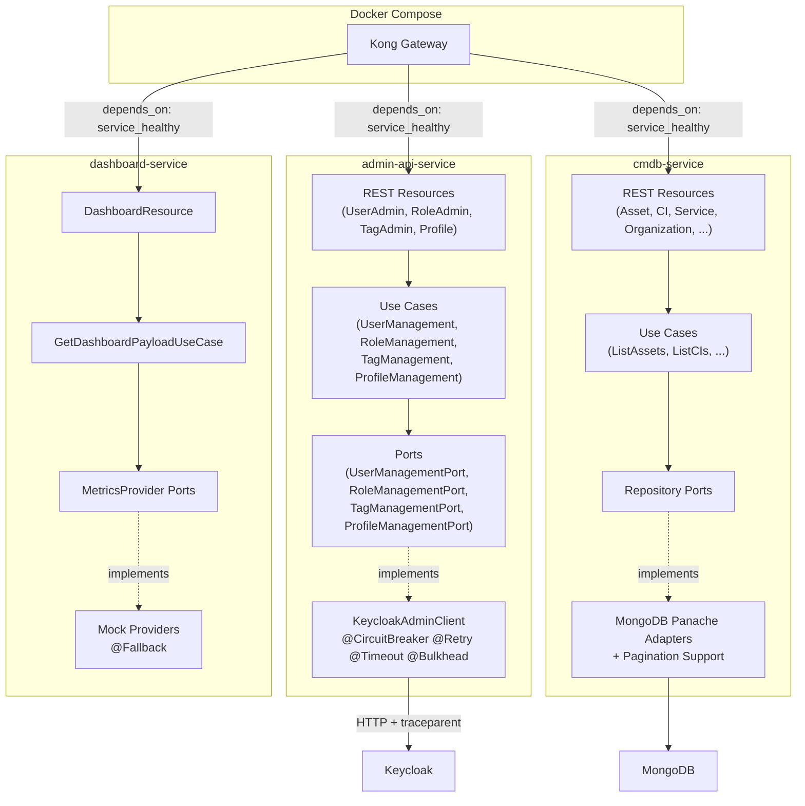

# Design Document

## Overview

This design addresses the architecture compliance gaps identified in the ZenAndOps platform assessment (8.2/10 overall, 3/10 resilience). The changes span three backend services — admin-api-service, cmdb-service, and dashboard-service — and the Docker Compose orchestration layer.

The work is organized into five cross-cutting concerns:

1. **Resilience** — Circuit breaker, retry, timeout, and bulkhead on KeycloakAdminClient; MongoDB timeouts for cmdb-service; fallback methods for dashboard-service metrics providers
2. **API Conventions** — Pagination for cmdb-service list endpoints; standard error envelope for dashboard-service
3. **Hexagonal Architecture** — Application layer (ports + use cases) for admin-api-service
4. **Observability** — W3C Trace Context propagation in KeycloakAdminClient outbound calls
5. **Infrastructure** — Health check extensions and Docker Compose health checks for all services

### Design Decisions

| Decision | Choice | Rationale |
|---|---|---|
| Fault tolerance annotations placement | Directly on `KeycloakAdminClient` public methods | The client is already `@ApplicationScoped` and CDI-managed; SmallRye Fault Tolerance intercepts CDI bean methods. No wrapper needed. |
| Non-retryable error detection | `@Retry(abortOn = KeycloakAdminException.class)` with status check in retry logic | HTTP 400/401/403/404/409 are client errors that will never succeed on retry. The `abortOn` parameter on `@Retry` prevents wasted retries. |
| Pagination DTO location | `com.zenandops.cmdb.infrastructure.rest.dto.PaginatedResponse<T>` | Pagination is a REST concern (infrastructure layer). The application layer returns `List<T>` + `long count`; the REST layer wraps them. |
| Application layer port granularity | Four ports: `UserManagementPort`, `RoleManagementPort`, `TagManagementPort`, `ProfileManagementPort` | Matches the four REST resource groups in admin-api-service. Each port has a focused interface. |
| Trace context injection | `OpenTelemetry.getPropagators().getTextMapPropagator().inject()` in `KeycloakAdminClient` request builder | Uses the standard OpenTelemetry API already on the classpath. No additional dependencies needed. |
| Docker Compose health check pattern | Reuse the `HealthCheck.java` utility from admin-api-service | All three services use the same Quarkus health endpoint pattern (`/q/health`). The lightweight Java health check class avoids adding curl/wget to minimal JRE images. |
| Fallback implementation | `@Fallback(fallbackMethod = "...")` on each mock provider method | SmallRye Fault Tolerance's `@Fallback` annotation integrates with the existing CDI bean lifecycle. Fallback methods return zeroed/neutral values. |

## Architecture

The changes follow the existing hexagonal architecture. No new services or databases are introduced.



### Dependency Flow (admin-api-service after refactoring)

```
REST Resource → Use Case → Port Interface ← KeycloakAdminClient (implements port)
```

The REST resources will no longer import `KeycloakAdminClient` directly. They inject use case classes, which depend on port interfaces. The `KeycloakAdminClient` implements those ports and is discovered by CDI.

## Components and Interfaces

### 1. Fault Tolerance Annotations on KeycloakAdminClient

The `KeycloakAdminClient` is the single outbound adapter that makes synchronous HTTP calls to Keycloak. All fault tolerance annotations are applied at the class level where possible, with method-level overrides where needed.

**Annotation stack (class-level):**

```java
@ApplicationScoped
@CircuitBreaker(
    requestVolumeThreshold = 5,
    failureRatio = 1.0,
    delay = 5000,
    delayUnit = ChronoUnit.MILLIS,
    successThreshold = 1
)
@Retry(
    maxRetries = 3,
    delay = 200,
    delayUnit = ChronoUnit.MILLIS,
    jitter = 100,
    jitterDelayUnit = ChronoUnit.MILLIS,
    retryOn = Exception.class,
    abortOn = KeycloakAdminException.class
)
@Timeout(value = 10, unit = ChronoUnit.SECONDS)
@Bulkhead(value = 10, waitingTaskQueue = 10)
public class KeycloakAdminClient implements UserManagementPort, RoleManagementPort,
                                            TagManagementPort, ProfileManagementPort {
```

**Non-retryable error handling:**

The `@Retry(abortOn = KeycloakAdminException.class)` configuration means that when the `handleStatus()` method throws a `KeycloakAdminException` for HTTP 400/401/403/404/409, the retry interceptor immediately aborts. Only transport-level exceptions (connection refused, timeout, interrupted) trigger retries.

**HttpClient timeout configuration:**

```java
@PostConstruct
void init() {
    this.httpClient = HttpClient.newBuilder()
            .connectTimeout(Duration.ofSeconds(5))
            .followRedirects(HttpClient.Redirect.NEVER)
            .build();
}
```

Each `HttpRequest` gets a per-request timeout:

```java
private HttpRequest buildGet(String url) {
    return HttpRequest.newBuilder()
            .uri(URI.create(url))
            .timeout(Duration.ofSeconds(10))
            .header("Authorization", "Bearer " + getAccessToken())
            .header("Accept", "application/json")
            .GET()
            .build();
}
```

### 2. W3C Trace Context Propagation

The `KeycloakAdminClient` injects `traceparent` and `tracestate` headers into every outbound HTTP request using the OpenTelemetry propagation API.

**Implementation approach:**

```java
@Inject
OpenTelemetry openTelemetry;

private void injectTraceContext(HttpRequest.Builder builder) {
    TextMapPropagator propagator = openTelemetry.getPropagators().getTextMapPropagator();
    propagator.inject(Context.current(), builder, (carrier, key, value) -> {
        if (carrier != null) {
            carrier.header(key, value);
        }
    });
}
```

This is called in every `buildGet`, `buildPost`, `buildPut`, `buildDelete`, and `buildDeleteWithBody` method before `.build()`. When no active span context exists, the propagator is a no-op and no headers are added.

### 3. Application Layer for admin-api-service

Four port interfaces are defined in `com.zenandops.admin.application.port`:

| Port Interface | Methods |
|---|---|
| `UserManagementPort` | `listUsers`, `getUser`, `createUser`, `updateUser`, `deleteUser`, `getUserRealmRoles`, `assignRealmRoles`, `removeRealmRoles` |
| `RoleManagementPort` | `listRealmRoles`, `getRealmRoleByName`, `getRealmRoleById`, `createRealmRole`, `updateRealmRole`, `deleteRealmRole` |
| `TagManagementPort` | `getRealmRepresentation`, `updateRealmRepresentation` |
| `ProfileManagementPort` | `getUser`, `updateUser`, `resetPassword` |

**Use case classes** in `com.zenandops.admin.application.usecase`:

| Use Case | Port | Description |
|---|---|---|
| `ListUsersUseCase` | `UserManagementPort` | Lists users with optional pagination |
| `GetUserUseCase` | `UserManagementPort` | Gets a single user by ID |
| `CreateUserUseCase` | `UserManagementPort` | Creates a user and returns the created representation |
| `UpdateUserUseCase` | `UserManagementPort` | Updates user fields |
| `DeleteUserUseCase` | `UserManagementPort` | Deletes a user |
| `GetUserRolesUseCase` | `UserManagementPort` | Gets realm roles for a user |
| `AssignUserRolesUseCase` | `UserManagementPort` | Assigns realm roles to a user |
| `RemoveUserRolesUseCase` | `UserManagementPort` | Removes realm roles from a user |
| `ListRolesUseCase` | `RoleManagementPort` | Lists all realm roles |
| `GetRoleUseCase` | `RoleManagementPort` | Gets a role by name or ID |
| `CreateRoleUseCase` | `RoleManagementPort` | Creates a realm role |
| `UpdateRoleUseCase` | `RoleManagementPort` | Updates a realm role |
| `DeleteRoleUseCase` | `RoleManagementPort` | Deletes a realm role |
| `ListTagsUseCase` | `TagManagementPort` | Lists tag definitions from realm attributes |
| `CreateTagUseCase` | `TagManagementPort` | Creates a tag definition |
| `UpdateTagUseCase` | `TagManagementPort` | Updates a tag definition |
| `DeleteTagUseCase` | `TagManagementPort` | Deletes a tag definition |
| `GetProfileUseCase` | `ProfileManagementPort` | Gets the current user's profile |
| `UpdateProfileUseCase` | `ProfileManagementPort` | Updates the current user's profile |
| `ResetPasswordUseCase` | `ProfileManagementPort` | Resets a user's password |

The `KeycloakAdminClient` implements all four port interfaces. The REST resources inject use case classes instead of `KeycloakAdminClient` directly.

**Dependency rule:** The application layer package (`com.zenandops.admin.application`) has zero imports from `com.zenandops.admin.infrastructure`. Port interfaces use only Java standard library types and domain types.

### 4. Pagination for cmdb-service

**PaginatedResponse DTO:**

```java
public record PaginatedResponse<T>(
    List<T> items,
    int page,
    int size,
    long totalItems,
    int totalPages
) {
    public static <T> PaginatedResponse<T> of(List<T> items, int page, int size, long totalItems) {
        int totalPages = (int) Math.ceil((double) totalItems / size);
        return new PaginatedResponse<>(items, page, size, totalItems, totalPages);
    }
}
```

**Repository port changes:**

Each repository port that supports listing gets a new paginated method:

```java
// In AssetRepository (and similar for other repositories)
List<Asset> findWithFilters(String organizationId, AssetType type, CostType costType,
                            AssetStatus status, String supplier, int page, int size);
long countWithFilters(String organizationId, AssetType type, CostType costType,
                      AssetStatus status, String supplier);
```

**Use case changes:**

List use cases accept `page` and `size` parameters and return a result object containing both the items and the total count. The REST layer wraps this into `PaginatedResponse`.

**REST layer validation:**

```java
@GET
public Response listAssets(@QueryParam("page") @DefaultValue("0") int page,
                           @QueryParam("size") @DefaultValue("50") int size,
                           /* existing filters */) {
    if (page < 0 || size < 1 || size > 200) {
        return Response.status(400)
                .entity(Map.of("error", new ErrorResponse("CMDB_VALIDATION_ERROR",
                        "page must be >= 0, size must be between 1 and 200",
                        Instant.now())))
                .build();
    }
    // ... delegate to use case
}
```

**MongoDB Panache pagination:**

```java
// In MongoAssetRepository (infrastructure adapter)
public List<Asset> findWithFilters(..., int page, int size) {
    PanacheQuery<Asset> query = buildFilterQuery(...);
    return query.page(Page.of(page, size)).list();
}

public long countWithFilters(...) {
    return buildFilterQuery(...).count();
}
```

**Affected list endpoints** (7 entity types):
- `/api/v1/cmdb/assets`
- `/api/v1/cmdb/cis`
- `/api/v1/cmdb/services`
- `/api/v1/cmdb/organizations`
- `/api/v1/cmdb/ci-relationships`
- `/api/v1/cmdb/service-dependencies`
- `/api/v1/cmdb/service-cis`

### 5. Dashboard Exception Mapper

```java
@Provider
public class DashboardExceptionMapper implements ExceptionMapper<RuntimeException> {

    @Override
    public Response toResponse(RuntimeException exception) {
        if (exception instanceof io.quarkus.security.UnauthorizedException) {
            return buildResponse(Response.Status.UNAUTHORIZED,
                    "DASHBOARD_UNAUTHORIZED", "Authentication required");
        }
        return buildResponse(Response.Status.INTERNAL_SERVER_ERROR,
                "DASHBOARD_INTERNAL_ERROR", exception.getMessage());
    }

    private Response buildResponse(Response.Status status, String code, String message) {
        ErrorResponse error = new ErrorResponse(code, message, Instant.now());
        return Response.status(status)
                .entity(Map.of("error", error))
                .build();
    }
}
```

The `ErrorResponse` record follows the same structure as admin-api-service and cmdb-service: `{"error": {"code": "...", "message": "...", "timestamp": "..."}}`.

### 6. Dashboard Fallback Methods

Each mock metrics provider gets `@Fallback` annotations on its methods. The fallback methods return zeroed/neutral values:

```java
@ApplicationScoped
public class MockIncidentMetricsProvider implements IncidentMetricsProvider {

    @Override
    @Fallback(fallbackMethod = "fallbackGetIncidentMetrics")
    public IncidentMetrics getIncidentMetrics() {
        return new IncidentMetrics(47.3, Trend.DOWN, 8.2, Trend.STABLE);
    }

    IncidentMetrics fallbackGetIncidentMetrics() {
        LOG.warn("Fallback invoked for MockIncidentMetricsProvider.getIncidentMetrics");
        return new IncidentMetrics(0.0, Trend.STABLE, 0.0, Trend.STABLE);
    }
}
```

**Fallback values per provider:**

| Provider | Fallback Value |
|---|---|
| `IncidentMetricsProvider` | `IncidentMetrics(0.0, STABLE, 0.0, STABLE)` |
| `TicketMetricsProvider` | `TicketsByState(0, 0, 0, 0, 0, 0)` |
| `SliSloMetricsProvider` | `SliSloCompliance(0.0, 0.0, 0.0, 0.0)` |
| `ChangeMetricsProvider.getChangeManagement` | `ChangeManagement(0.0, 0, 0)` |
| `ChangeMetricsProvider.getErrorBudget` | `ErrorBudget(0.0, 0.0, 0)` |

### 7. Health Check Extensions and Docker Compose

**cmdb-service and dashboard-service** get the `quarkus-smallrye-health` dependency added to their POMs. Quarkus auto-configures `/q/health`, `/q/health/live`, and `/q/health/ready` endpoints.

**Docker Compose health checks** for dashboard-service and cmdb-service follow the same pattern as admin-api-service:

```yaml
dashboard-service:
  healthcheck:
    test: ["CMD", "java", "-cp", "/app/healthcheck", "HealthCheck", "http://localhost:8082/q/health"]
    interval: 10s
    timeout: 5s
    retries: 5
    start_period: 30s
```

The Dockerfiles for cmdb-service and dashboard-service are updated to compile and include the `HealthCheck.java` utility class (same pattern as admin-api-service).

**Kong Gateway depends_on** is updated from `condition: service_started` to `condition: service_healthy` for dashboard-service and cmdb-service.

### 8. MongoDB Timeout Configuration

Added to `cmdb-service/src/main/resources/application.properties`:

```properties
quarkus.mongodb.connect-timeout=5s
quarkus.mongodb.server-selection-timeout=5s
quarkus.mongodb.read-timeout=10s
```

### 9. Fault Tolerance Dependencies

All three services get `quarkus-smallrye-fault-tolerance` added to their Maven POMs:

```xml
<dependency>
    <groupId>io.quarkus</groupId>
    <artifactId>quarkus-smallrye-fault-tolerance</artifactId>
</dependency>
```

## Data Models

### PaginatedResponse (cmdb-service)

```java
/**
 * Generic paginated response wrapper for list endpoints.
 */
public record PaginatedResponse<T>(
    List<T> items,
    int page,
    int size,
    long totalItems,
    int totalPages
) {}
```

**JSON representation:**

```json
{
  "items": [ /* entity objects */ ],
  "page": 0,
  "size": 50,
  "totalItems": 127,
  "totalPages": 3
}
```

### ErrorResponse (dashboard-service)

```java
/**
 * Standard error response DTO following the platform error envelope format.
 */
public record ErrorResponse(String code, String message, Instant timestamp) {}
```

**JSON representation (wrapped in error envelope):**

```json
{
  "error": {
    "code": "DASHBOARD_INTERNAL_ERROR",
    "message": "Unexpected error occurred",
    "timestamp": "2026-01-15T10:30:00Z"
  }
}
```

### Port Interfaces (admin-api-service)

The port interfaces use Java standard library types (`Map<String, Object>`, `List<Map<String, Object>>`, `String`) to maintain the same contract as the existing `KeycloakAdminClient` public methods. No new domain entities are introduced in this iteration — the typed domain model for admin-api-service is a future enhancement.

```java
public interface UserManagementPort {
    List<Map<String, Object>> listUsers(Integer first, Integer max);
    Map<String, Object> getUser(String userId);
    String createUser(Map<String, Object> userRepresentation);
    void updateUser(String userId, Map<String, Object> userRepresentation);
    void deleteUser(String userId);
    List<Map<String, Object>> getUserRealmRoles(String userId);
    void assignRealmRoles(String userId, List<Map<String, Object>> roles);
    void removeRealmRoles(String userId, List<Map<String, Object>> roles);
}
```

## Correctness Properties

*A property is a characteristic or behavior that should hold true across all valid executions of a system — essentially, a formal statement about what the system should do. Properties serve as the bridge between human-readable specifications and machine-verifiable correctness guarantees.*

### Property 1: Non-retryable errors are never retried

*For any* HTTP response from Keycloak with status code in {400, 401, 403, 404, 409}, the `KeycloakAdminClient` SHALL propagate the corresponding `KeycloakAdminException` immediately without any retry attempts.

**Validates: Requirements 3.7**

### Property 2: Pagination totalPages calculation

*For any* positive `totalItems` value and any valid `size` in [1, 200], the `PaginatedResponse.totalPages` SHALL equal `ceil(totalItems / size)`.

**Validates: Requirements 7.4**

### Property 3: Pagination rejects invalid parameters

*For any* `page` value less than 0, or any `size` value less than 1 or greater than 200, the CMDB list endpoints SHALL return HTTP 400 with an Error_Envelope containing code `CMDB_VALIDATION_ERROR`.

**Validates: Requirements 7.6**

### Property 4: Out-of-range page returns empty items with correct totals

*For any* dataset and any `page` number greater than or equal to `totalPages`, the CMDB list endpoints SHALL return an empty `items` array while `totalItems` and `totalPages` reflect the actual dataset size.

**Validates: Requirements 7.5**

### Property 5: Paginated response contains all required fields

*For any* valid `page` and `size` parameters sent to any CMDB list endpoint, the response SHALL contain `items` (array), `page` (int), `size` (int), `totalItems` (long), and `totalPages` (int) fields.

**Validates: Requirements 7.1, 7.3**

### Property 6: Dashboard exception mapper produces valid Error_Envelope

*For any* unhandled `RuntimeException` thrown during dashboard request processing, the exception mapper SHALL return HTTP 500 with a JSON body matching `{"error": {"code": "DASHBOARD_INTERNAL_ERROR", "message": "...", "timestamp": "..."}}`.

**Validates: Requirements 8.1, 8.2, 8.4**

### Property 7: Fallback returns zeroed safe defaults with STABLE trends

*For any* `MetricsProvider` implementation that throws an exception, the fallback method SHALL return a non-null value with all numeric fields set to zero and all `Trend` fields set to `Trend.STABLE`.

**Validates: Requirements 11.1, 11.2**

### Property 8: Application layer has zero infrastructure dependencies

*For any* Java source file in the `com.zenandops.admin.application` package, the file SHALL contain zero import statements referencing `com.zenandops.admin.infrastructure`.

**Validates: Requirements 9.8**

## Error Handling

### KeycloakAdminClient Error Classification

| HTTP Status | Classification | Behavior |
|---|---|---|
| 400 Bad Request | Non-retryable | Propagate `KeycloakAdminException(400, ...)` immediately |
| 401 Unauthorized | Non-retryable | Propagate `KeycloakAdminException(401, ...)` immediately |
| 403 Forbidden | Non-retryable | Propagate `KeycloakAdminException(403, ...)` immediately |
| 404 Not Found | Non-retryable | Propagate `KeycloakAdminException(404, ...)` immediately |
| 409 Conflict | Non-retryable | Propagate `KeycloakAdminException(409, ...)` immediately |
| 500+ Server Error | Retryable | Retry up to 3 times with exponential backoff |
| Connection refused | Retryable | Retry up to 3 times with exponential backoff |
| Timeout | Retryable | Retry up to 3 times with exponential backoff |

### Circuit Breaker States

| State | Behavior |
|---|---|
| **Closed** | All calls pass through normally. Failures are counted. |
| **Open** | All calls are rejected immediately with `CircuitBreakerOpenException`. Lasts 5 seconds. |
| **Half-Open** | One probe call is allowed. If it succeeds → Closed. If it fails → Open. |

The `AdminExceptionMapper` handles `CircuitBreakerOpenException` and `BulkheadException` by returning HTTP 503 Service Unavailable with the standard error envelope.

### Bulkhead Overflow

When the bulkhead queue is full (10 concurrent + 10 queued), new requests receive a `BulkheadException`, which the exception mapper translates to HTTP 503.

### Pagination Validation Errors

| Condition | HTTP Status | Error Code |
|---|---|---|
| `page < 0` | 400 | `CMDB_VALIDATION_ERROR` |
| `size < 1` | 400 | `CMDB_VALIDATION_ERROR` |
| `size > 200` | 400 | `CMDB_VALIDATION_ERROR` |

### Dashboard Fallback Logging

When a fallback is invoked, the provider logs a warning:

```
WARN [MockIncidentMetricsProvider] Fallback invoked for getIncidentMetrics: <exception message>
```

## Testing Strategy

### Property-Based Testing

The project uses **jqwik** (already present in admin-api-service and cmdb-service POMs) for property-based testing. Each property test runs a minimum of 100 iterations.

**Property tests to implement:**

| Property | Test Class | What Varies |
|---|---|---|
| Property 2: totalPages calculation | `PaginatedResponsePropertyTest` | `totalItems` (0 to 10000), `size` (1 to 200) |
| Property 3: Invalid pagination params | `PaginationValidationPropertyTest` | Negative pages, sizes outside [1, 200] |
| Property 5: Response structure | `PaginatedResponseStructurePropertyTest` | Random page/size combinations |
| Property 6: Exception mapper envelope | `DashboardExceptionMapperPropertyTest` | Random RuntimeException messages |
| Property 7: Fallback safe defaults | `MetricsProviderFallbackPropertyTest` | Random exception types and messages |

**Tag format:** Each test is tagged with a comment referencing the design property:
```java
// Feature: architecture-resilience-compliance, Property 2: Pagination totalPages calculation
```

### Unit Tests (Example-Based)

| Test | What It Verifies |
|---|---|
| `PaginatedResponse.of()` with known values | Default page=0, size=50 behavior (Req 7.2) |
| Dashboard exception mapper with `UnauthorizedException` | HTTP 401 + `DASHBOARD_UNAUTHORIZED` (Req 8.3) |
| Fallback logging verification | Warning log emitted with provider name (Req 11.3) |

### Integration Tests

| Test | What It Verifies |
|---|---|
| Health endpoint smoke test (cmdb-service) | `/q/health` returns 200 (Req 2.3) |
| Health endpoint smoke test (dashboard-service) | `/q/health` returns 200 (Req 2.4) |
| Circuit breaker integration | 5 failures open the circuit (Req 3.4–3.6) |
| Retry with mock server | Transient failures are retried 3 times (Req 3.3) |
| Bulkhead concurrency test | 10 concurrent + 10 queued + overflow rejection (Req 4.1–4.3) |

### Static Analysis

| Check | What It Verifies |
|---|---|
| Application layer import scan | No infrastructure imports in `com.zenandops.admin.application` (Property 8, Req 9.8) |
| POM dependency verification | All three services have fault tolerance and health dependencies (Req 1.1–1.3, 2.1–2.2) |

### Tests NOT Suitable for PBT

- Docker Compose health check configuration (Req 6.x) — declarative YAML, verified by manual `docker-compose up`
- MongoDB timeout configuration (Req 5.x) — application.properties values, verified by smoke test
- W3C Trace Context propagation (Req 10.x) — requires active OpenTelemetry context, verified by integration test
- Circuit breaker state transitions (Req 3.4–3.6) — time-dependent behavior, verified by integration test with mock server
